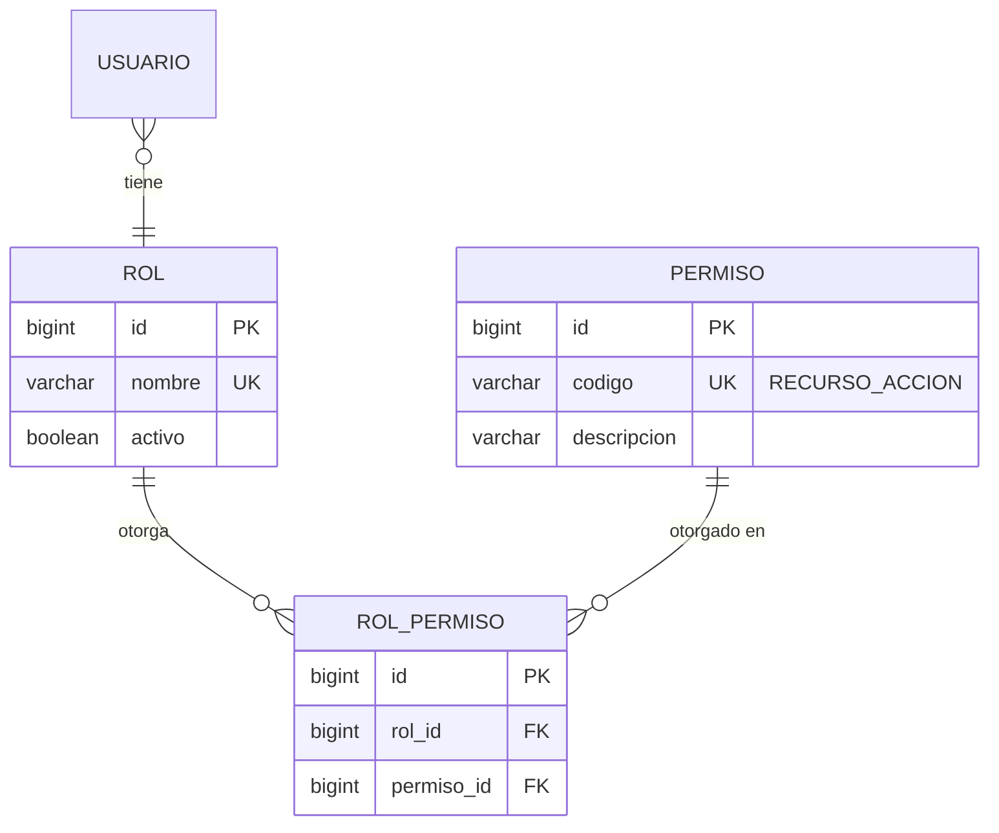

# Actualización — Roles y Permisos (basado en tu proyecto Medical Management)


## Por qué cambio la decisión de Fase 2

En Fase 2 recomendé un catálogo cerrado (`ADMINISTRADOR`, `OPERADOR`) sin tabla de permisos, para no sobreingenierizar con solo 2 roles. Sigo pensando que hoy son 2 roles, pero el patrón de tu proyecto Medical Management resuelve un problema real que si aparece **no vale la pena resolver con un enum**: qué pasa cuando mañana necesitas un tercer rol (ej. "Contador" con acceso de solo lectura a reportes financieros, sin poder tocar pagos) — con permisos como tabla, se crea el rol y se le asignan permisos existentes, sin tocar código. Con roles hardcodeados, tocarías el código de autorización. Es el mismo principio Open/Closed que ya veníamos aplicando en la Fase 4. Adoptar el patrón desde ahora tiene bajo costo y es consistente con algo que ya construiste y validaste en producción.

## 1. Patrón extraído de tu proyecto

| Elemento | Cómo lo resolviste en Medical Management |
|---|---|
| Modelo de datos | `Rol` N:M `Permiso` (tabla de unión), `Usuario` N:1 `Rol` |
| Convención de nombres de permiso | `RECURSO_ACCION` — ej. `USUARIOS_READ`, `CITAS_CREATE`, `PACIENTES_DELETE` |
| Autorización backend | `@PreAuthorize` a nivel de endpoint, verificando el permiso (no el nombre del rol) |
| Autorización frontend | Rutas protegidas por permiso (`USUARIOS_READ`), no por rol — el rol es solo la etiqueta visible al usuario |
| Login response | Devuelve `accessToken`, `refreshToken`, `roles[]` y `permisos[]` juntos, para que el frontend arme su control visual sin volver a preguntar |
| Formato de respuesta | Envelope estándar (`success`, `message`, `data`, `timestamp`) para toda la API |

Este patrón desacopla "qué rol tiene el usuario" de "qué puede hacer" — que es exactamente el enfoque correcto para RBAC. Lo adopto completo para el parqueadero.

## 2. Adaptación al modelo de datos (actualiza la Fase 3 aprobada)



Esto **reemplaza** la tabla `ROL` simple del modelo de Fase 3 (que era solo un catálogo cerrado) por el par `ROL`/`PERMISO`/`ROL_PERMISO`. El resto del modelo de Fase 3 no cambia.

## 3. Catálogo de permisos propuesto para el parqueadero [RECOMENDACIÓN]

Siguiendo tu misma convención `RECURSO_ACCION`, derivado de los casos de uso ya definidos en Fase 2:

```
CLIENTES_READ, CLIENTES_CREATE, CLIENTES_UPDATE, CLIENTES_DELETE
VEHICULOS_READ, VEHICULOS_CREATE, VEHICULOS_UPDATE, VEHICULOS_DELETE
MENSUALIDADES_READ, MENSUALIDADES_CREATE, MENSUALIDADES_UPDATE, MENSUALIDADES_DELETE
PAGOS_READ, PAGOS_CREATE, PAGOS_ANULAR
MOVIMIENTOS_READ, MOVIMIENTOS_CREATE_INGRESO, MOVIMIENTOS_CREATE_SALIDA, MOVIMIENTOS_ANULAR
TARIFAS_READ, TARIFAS_CREATE, TARIFAS_UPDATE
CAPACIDAD_READ, CAPACIDAD_UPDATE
USUARIOS_READ, USUARIOS_CREATE, USUARIOS_UPDATE, USUARIOS_DELETE
ROLES_READ, ROLES_CREATE, ROLES_UPDATE
AUDITORIA_READ
REPORTES_READ
DASHBOARD_READ
BACKUPS_READ, BACKUPS_CREATE
```

`_DELETE` en este catálogo **nunca implica DELETE físico** (RN9 sigue vigente) — es el permiso para ejecutar una desactivación/anulación lógica, se mantiene el nombre por consistencia con tu convención existente.

**Asignación inicial de roles [RECOMENDACIÓN, ajustable sin tocar código]:**
- `ADMINISTRADOR`: todos los permisos.
- `OPERADOR`: todos los `_READ`, más `CLIENTES_CREATE/UPDATE`, `VEHICULOS_CREATE/UPDATE`, `MENSUALIDADES_CREATE`, `PAGOS_CREATE`, `MOVIMIENTOS_CREATE_INGRESO/SALIDA`. Sin `TARIFAS_*`, `CAPACIDAD_UPDATE`, `USUARIOS_*`, `ROLES_*`, `_DELETE`, `PAGOS_ANULAR`, `MOVIMIENTOS_ANULAR` — consistente con RN8 y sección 17 del análisis original.

## 4. Impacto en la arquitectura (actualiza Fase 4, sección 6 — Seguridad)

El interceptor de autorización que ya había definido como "aspecto transversal" ahora verifica **códigos de permiso**, no nombres de rol — igual que tu `@PreAuthorize`:

```java
@PreAuthorize("hasAuthority('PAGOS_CREATE')")
```

en vez de:

```java
@PreAuthorize("hasRole('OPERADOR')")
```

Esto es justo la diferencia entre acoplar autorización a la estructura organizacional (roles) versus a capacidades (permisos) — la segunda es más estable en el tiempo.

**JWT / login response:** adopto tu mismo contrato de respuesta (`accessToken`, `refreshToken`, `roles[]`, `permisos[]`, envelope `success/message/data/timestamp`) como estándar para todo `/auth/login` del sistema de parqueadero. Esto también resuelve por adelantado parte de la Fase 5 (formato estándar de respuesta de la API) — lo dejo fijado aquí en vez de re-decidirlo después.

## 5. Decisión pendiente nueva

**`[DECISIÓN PENDIENTE 13]`** En tu proyecto de citas médicas, ¿los permisos se asignan **solo por rol** (todo usuario con rol X tiene exactamente los permisos de X), o alguna vez permitiste **excepciones por usuario individual** (un operador puntual con un permiso extra)?
- RECOMENDACIÓN: solo por rol, igual que parece estar en tu README — es más simple, más auditable, y con 2 roles reales no se justifica la complejidad de permisos por usuario individual. Si confirmas que en Medical Management tampoco lo hiciste así, queda cerrado sin necesidad de más discusión.

---
