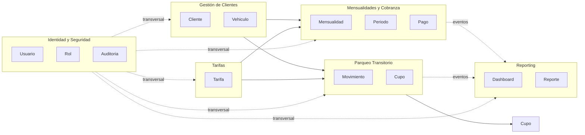
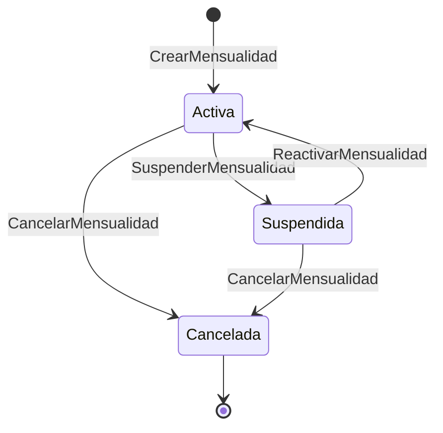
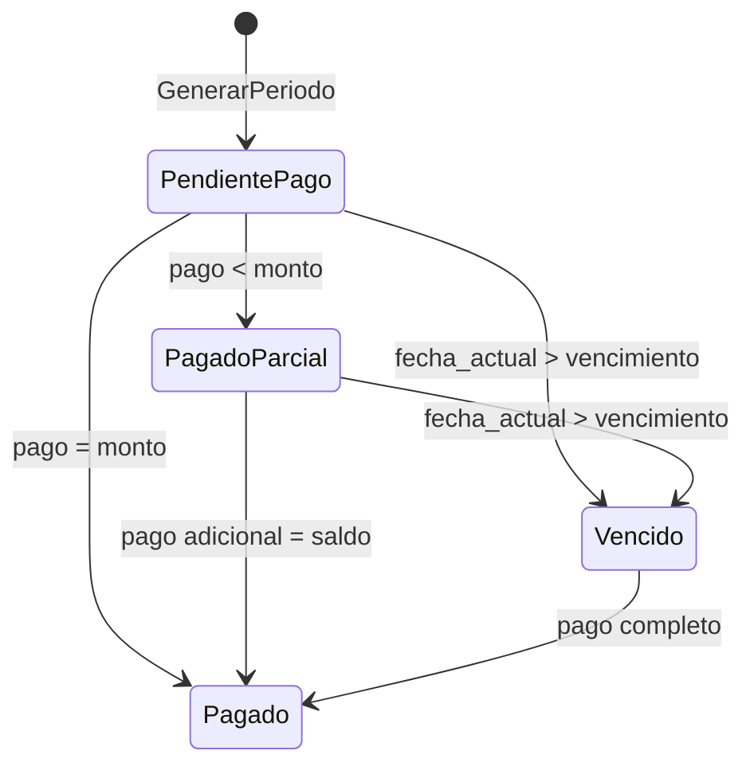
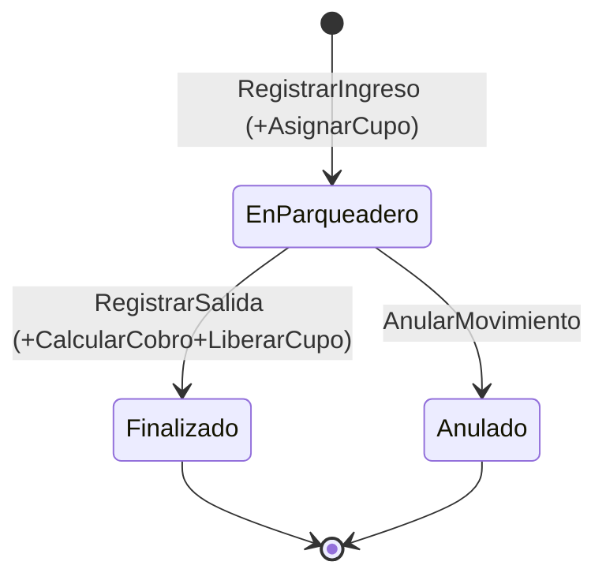
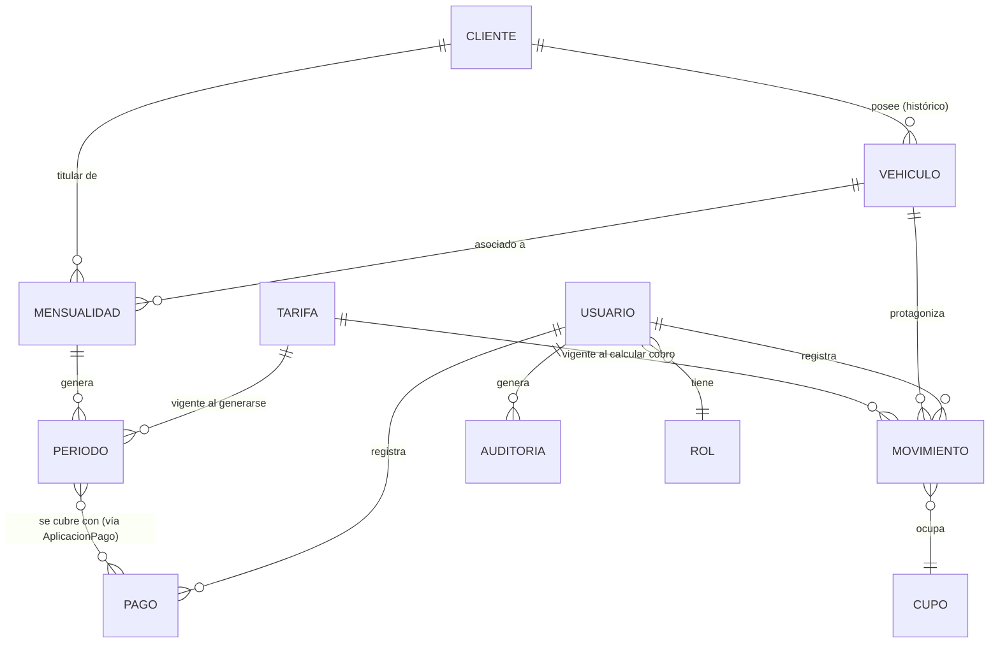

# FASE 2 — MODELO DE DOMINIO

## 1. Actores

| Actor | Tipo | Descripción |
|---|---|---|
| **Administrador** | Humano, interno | Control total: tarifas, cupos, usuarios, configuración crítica, reportes financieros. [ORIGEN: requerimientos] |
| **Operador** | Humano, interno | Operación diaria: registrar clientes/vehículos, pagos, ingresos/salidas de visitantes. Sin permisos sobre tarifas, cupos, usuarios ni eliminación de registros. [ORIGEN: requerimientos, sección 17] |
| **Cliente mensual** | Humano, externo | No interactúa directamente con el sistema (no hay portal de autoservicio en el alcance declarado). Es un **sujeto de datos**, no un actor del sistema. `[DECISIÓN PENDIENTE]` ver más abajo. |
| **Visitante** | Humano, externo | Igual que el cliente mensual: sujeto de datos de un `Movimiento`, no actor del sistema. |
| **Sistema de notificaciones** | Actor secundario (externo) | Recibe eventos de dominio y envía notificaciones (canal no definido aún). |
| **Sistema de backups** | Actor secundario (externo/infraestructura) | Ejecuta la estrategia de respaldo definida en DevOps (Fase 4/8). |
| **Reloj del sistema** | Actor secundario (temporal) | Dispara procesos de vencimiento de mensualidades, generación de períodos, etc. |

`[DECISIÓN PENDIENTE 6]` El documento de requerimientos no menciona un portal para clientes (consulta de su propio estado de cuenta). ¿Está fuera de alcance del MVP, o se espera un acceso de solo lectura para clientes? Asumo **fuera de alcance del MVP** — RECOMENDACIÓN: dejarlo como funcionalidad futura, ya que ni el Excel ni el documento de requerimientos dan evidencia de que exista hoy.

---

## 2. Casos de uso

```mermaid
flowchart TB
    Admin[Administrador]
    Oper[Operador]

    subgraph Clientes y Vehículos
        UC1[RegistrarCliente]
        UC2[RegistrarVehiculo]
        UC3[ConsultarCliente]
    end

    subgraph Mensualidades y Pagos
        UC4[CrearMensualidad]
        UC5[GenerarPeriodoMensual]
        UC6[RegistrarPago]
        UC7[ConsultarEstadoCuenta]
        UC8[ConsultarDeudores]
        UC9[SuspenderMensualidad]
        UC10[CancelarMensualidad]
    end

    subgraph Parqueo por Horas
        UC11[RegistrarIngresoVisitante]
        UC12[RegistrarSalidaVisitante]
        UC13[CalcularCobro]
    end

    subgraph Cupos y Tarifas
        UC14[AsignarCupo]
        UC15[LiberarCupo]
        UC16[ConsultarOcupacion]
        UC17[ConfigurarTarifa]
        UC18[ConfigurarCapacidad]
    end

    subgraph Administración
        UC19[ConsultarDashboard]
        UC20[GenerarReporte]
        UC21[GestionarUsuarios]
        UC22[ConsultarAuditoria]
        UC23[RealizarBackup]
    end

    Oper --> UC1 & UC2 & UC3 & UC4 & UC6 & UC7 & UC8 & UC11 & UC12
    Admin --> UC5 & UC9 & UC10 & UC13 & UC14 & UC15 & UC16 & UC17 & UC18 & UC19 & UC20 & UC21 & UC22 & UC23
```

Nota: `CalcularCobro`, `AsignarCupo` y `LiberarCupo` son ejecutados internamente por el sistema durante `RegistrarSalidaVisitante`/`RegistrarIngresoVisitante` — los muestro como casos de uso separados porque son unidades de lógica de dominio reutilizables (ver Servicios de dominio), no porque un actor humano los dispare directamente.

---

## 3. Mapa del dominio y Bounded Contexts

Dado el tamaño real del negocio (~15 clientes, un parqueadero), **no se justifica** dividir en microservicios ni en múltiples bounded contexts con bases de datos separadas (se justificará en Fase 4). Pero sí conviene separar **subdominios lógicos** dentro de un mismo modular monolith, porque tienen ciclos de vida y reglas distintas:

- **BC1 Gestión de Clientes**: dueño de `Cliente` y `Vehiculo`. [ORIGEN: Excel + requerimientos]
- **BC2 Mensualidades y Cobranza**: dueño de `Mensualidad`, `Periodo`, `Pago`. Es el corazón del negocio actual (todo el Excel gira en torno a esto).
- **BC3 Parqueo Transitorio**: dueño de `Movimiento` (ingreso/salida) y `Cupo`. **No existe hoy en el Excel** — es 100% nuevo, viene del documento de requerimientos.
- **BC4 Tarifas**: catálogo versionado, consumido tanto por Mensualidades (tarifa mensual) como por Parqueo Transitorio (tarifa por hora).
- **BC5 Identidad y Seguridad**: transversal — usuarios, roles, auditoría.
- **BC6 Reporting**: solo lectura, agregando datos de los demás contextos (dashboard, deudores, reportes).

---

## 4. Clasificación DDD de los conceptos

| Concepto | Clasificación | Justificación |
|---|---|---|
| **Cliente** | Entidad (raíz de agregado) | Tiene identidad propia, ciclo de vida largo, se referencia desde Vehículo y Mensualidad. |
| **Vehículo** | Entidad, dentro del agregado Cliente | No tiene sentido de negocio fuera de un dueño; su ciclo de vida (alta/cambio de placa) depende del cliente. Ver regla de negocio sobre cambio de placa (sección 6). |
| **Mensualidad** | Entidad (raíz de agregado) | Representa el contrato entre cliente/vehículo y el parqueadero; tiene estado y ciclo de vida propio (activa/suspendida/cancelada), independiente del ciclo de vida del cliente. |
| **Periodo** | Entidad, dentro del agregado Mensualidad | Representa un mes específico de una mensualidad, con su propio vencimiento y saldo. Necesita identidad porque se referencia individualmente desde los pagos. |
| **Pago** | Entidad (raíz de agregado propio, no sub-entidad) | RECOMENDACIÓN: un pago es un hecho financiero inmutable que puede, en teoría, cubrir más de un `Periodo` a la vez (regla 7 del prompt original: "pagos que cubren varios periodos"). Si fuera sub-entidad de `Periodo` no podría modelar un pago que cubre 2 periodos limpiamente. Por eso lo trato como agregado propio, relacionado con uno o varios `Periodo` mediante una tabla de aplicación de pago (`AplicacionPago`). |
| **Deuda** | **No es entidad — es un dato derivado/vista** | RECOMENDACIÓN: "deudor" es simplemente un `Periodo` (o conjunto de periodos) de una `Mensualidad` cuyo saldo pendiente > 0 y cuya fecha de vencimiento ya pasó. No debe existir una tabla "Deudores" separada (ese fue precisamente el problema detectado en el Excel — sección Fase 1, hallazgo F). |
| **Movimiento** | Entidad (raíz de agregado) | Un registro de ingreso/salida de un vehículo transitorio. Ver `[DECISIÓN PENDIENTE 7]` abajo sobre si Ingreso y Salida son la misma entidad o dos. |
| **Ingreso / Salida** | Ver decisión pendiente 7 | — |
| **Cupo** | Entidad + Value Object combinados | RECOMENDACIÓN (ver justificación completa en Fase 3, sección 9 del prompt original): el **conteo de capacidad por tipo de vehículo** es lo que realmente controla la concurrencia (un `Value Object`/contador con control transaccional), no cupos numerados físicos, porque ni el Excel ni el documento de requerimientos indican que existan espacios numerados o señalizados. Modelar "cupo físico individual" sin esa necesidad real sería sobreingeniería. Este es un punto a confirmar contigo — ver decisión pendiente 8. |
| **Tarifa** | Entidad versionada (raíz de agregado) | Debe conservar histórico (sección 10 del prompt original) — cada cambio de tarifa crea una nueva versión con vigencia `desde/hasta`, nunca se sobrescribe. |
| **Usuario** | Entidad (raíz de agregado) | Identidad de acceso al sistema. |
| **Rol** | Catálogo / Entidad de configuración | Conjunto fijo por ahora: `Administrador`, `Operador` (sección 17 del prompt original). No se ve necesidad de roles dinámicos definidos por el usuario final — RECOMENDACIÓN: catálogo cerrado en el MVP, no una tabla de permisos configurable (evita sobreingeniería). |
| **Auditoria** | Entidad de solo-append (inmutable) | Registro de eventos de dominio relevantes; nunca se actualiza ni se borra. |
| **Notificación** | Entidad, generada por eventos de dominio | Se dispara como reacción a eventos (pago registrado, mensualidad vencida, etc.). |
| **Reporte / Dashboard** | No son entidades persistentes — son **proyecciones de solo lectura** | Se calculan a partir de los demás agregados; no tienen ciclo de vida propio. |
| **TipoVehiculo** | Value Object / catálogo abierto | `[SUPUESTO]` catálogo abierto y administrable (Admin puede agregar tipos), no un enum fijo en código — así se evita migración de esquema si mañana se admiten carros. |
| **Placa** | Value Object | Se valida por formato, es inmutable como valor pero **puede cambiar de vehículo asignado** (ver historial, sección 6 del prompt original) — por eso el cambio de placa genera un nuevo registro histórico, no una edición silenciosa. |
| **Dinero/Monto** | Value Object | Nunca un `float` suelto (el Excel usa floats, lo cual es una de las "soluciones improvisadas" a corregir) — en el modelo de dominio es un Value Object con validación de no-negatividad. |
| **RangoVigencia (desde/hasta)** | Value Object | Usado por `Tarifa` y por el histórico de `Mensualidad`/`Vehiculo`. |

**Servicios de dominio** (lógica que no pertenece naturalmente a una sola entidad):
- `CalculadorDeCobroPorHoras`: dado un `Movimiento` (hora ingreso/salida) y la `Tarifa` vigente, calcula el monto a cobrar, aplicando fracciones de hora y tope diario.
- `CalculadorDeEstadoMensualidad`: dado un conjunto de `Periodo` y sus `Pago` asociados, deriva el estado de cuenta (al día / en mora / cuánto debe) — **sin persistir el resultado como fuente de verdad**, solo como caché opcional (ver regla de negocio sobre datos derivados).
- `AsignadorDeCupo`: gestiona la reserva/liberación transaccional de capacidad disponible por tipo de vehículo.
- `GeneradorDePeriodos`: crea el `Periodo` del mes siguiente para cada `Mensualidad` activa (reemplaza al proceso manual de "copiar la hoja cada mes" detectado en el Excel).

**Eventos de dominio** (candidatos, se confirman en Fase 4/5):
`ClienteRegistrado`, `VehiculoAsociado`, `MensualidadCreada`, `PeriodoGenerado`, `PagoRegistrado`, `PeriodoVencido`, `MensualidadSuspendida`, `MensualidadCancelada`, `VehiculoIngreso`, `VehiculoSalida`, `CupoAgotado`, `TarifaActualizada`, `UsuarioCreado`.

---

## 5. Estados y transiciones

**Mensualidad:**

**Periodo (estado derivado, no siempre persistido — ver sección 7):**

`[SUPUESTO]` "Vencido" es un estado **calculado en tiempo de consulta** (fecha actual vs. fecha de vencimiento + saldo > 0), no un estado que se escribe en base de datos mediante un job — evita el problema de "estado_pago" desincronizado detectado en el Excel.

**Movimiento (parqueo por horas):**

---

## 6. Reglas de negocio identificadas

| # | Regla | Origen |
|---|---|---|
| RN1 | Un cliente puede tener uno o más vehículos asociados. | Excel (implícito) |
| RN2 | Un vehículo pertenece a un único cliente en un momento dado, pero puede cambiar de dueño (requiere histórico, no sobrescritura). | RECOMENDACIÓN |
| RN3 | El cambio de placa de un vehículo debe conservar el historial de la placa anterior. | requerimientos, sección 6 |
| RN4 | Un `Periodo` de mensualidad vencido y no pagado se considera deuda; no existe una entidad "Deuda" separada, es una condición derivada. | RECOMENDACIÓN (corrige hallazgo F de Fase 1) |
| RN5 | Un `Pago` puede aplicarse a uno o varios `Periodo` (pago adelantado o que cubre varios meses). | requerimientos, sección 7 |
| RN6 | Un cambio de `Tarifa` nunca debe alterar cobros ya calculados con la tarifa anterior. | requerimientos, sección 10 |
| RN7 | Un `Movimiento` de parqueo transitorio no puede iniciarse si no hay `Cupo` disponible para ese tipo de vehículo. | requerimientos, sección 8-9 |
| RN8 | El `Operador` no puede modificar tarifas, cupos, usuarios ni eliminar registros. | requerimientos, sección 17 |
| RN9 | Los registros financieros y de movimientos no se eliminan físicamente; se anulan o desactivan conservando el histórico. | requerimientos, regla 26 |
| RN10 | Toda operación crítica (pago, ingreso, salida, anulación, cambio de tarifa, gestión de usuarios) debe generar un registro de auditoría inmutable. | requerimientos, sección 18 |
| RN11 | `Estado_Del_Pago` como texto libre queda descartado; el estado de un `Periodo` se deriva de sus pagos y fecha de vencimiento (no se persiste como texto libre editable). | RECOMENDACIÓN, corrige hallazgo A de Fase 1 |

Respuesta rápida: ¿qué reemplaza al texto libre de Estado_Del_Pago?

No se reemplaza por otro campo editable en base de datos — se reemplaza por un valor calculado en tiempo de consulta, no por algo que un operador pueda escribir o corregir a mano. Concretamente:

Es un Value Object EstadoPeriodo (un enum cerrado: AL_DIA, PENDIENTE, EN_MORA, PAGADO_ANTICIPADO), producido por el servicio de dominio CalculadorDeEstadoMensualidad a partir de: el monto del Periodo, la suma de AplicacionPago asociadas, y la fecha de vencimiento comparada con la fecha actual.
No existe una columna estado que un operador pueda editar. Si el operador registra un pago, el estado cambia automáticamente porque se recalcula; si no hay pago, sigue "pendiente/en mora" automáticamente cuando pasa la fecha. Esto elimina de raíz el problema que vimos en el Excel (Pago, pago, Psgo, Pendiente como texto libre y desincronizado).
Si por rendimiento algún día se necesita cachear ese estado (por ejemplo para no recalcular en cada consulta del dashboard con miles de periodos), se podría persistir como columna de solo lectura recalculada por el sistema, nunca editable por el usuario — pero para el tamaño actual del negocio (~15 clientes) esto ni siquiera es necesario en el MVP. Lo dejo anotado como optimización futura, no como parte del modelo base.
`[DECISIÓN PENDIENTE 9]` No tengo información para definir: ¿qué pasa exactamente si un cliente se retira con saldo pendiente? ¿Se cancela la mensualidad y la deuda queda registrada como incobrable, o debe bloquear la cancelación hasta que pague? Necesito tu decisión antes de la Fase 5 (no bloquea el modelo de dominio actual).

---

## 7. Relaciones y cardinalidades (modelo conceptual)

Notas de cardinalidad:
- **Cliente 1—N Vehículo**: confirmado por el Excel (aunque hoy solo se ve 1 vehículo por cliente en la mayoría de casos, el modelo debe soportar N).
- **Vehículo N—N Mensualidad a través del tiempo, pero 1—1 activa**: un vehículo tiene como máximo una mensualidad *activa* a la vez, pero puede tener varias a lo largo de su historia (cambios de plan). Se modela como 1—N con solo una activa por regla de negocio, no por restricción estructural rígida.
- **Periodo N—N Pago**: justifica la entidad intermedia `AplicacionPago` (RN5).
- **Movimiento N—1 Cupo** en el momento de la ocupación; `Cupo` en este modelo conceptual es más una "categoría con capacidad" que un espacio físico individual — se resuelve definitivamente en la decisión pendiente 8.

---

## 8. Decisiones pendientes que quedaron abiertas en esta fase

**`[DECISIÓN PENDIENTE 7]`** ¿Ingreso y Salida de un vehículo transitorio deben ser una sola entidad `Movimiento` (con `hora_salida` nullable) o dos entidades independientes (`Ingreso`, `Salida`) relacionadas?
- Alternativa A (una entidad `Movimiento`): más simple, un solo lugar para consultar "quién está adentro ahora mismo" (`hora_salida IS NULL`).
- Alternativa B (dos entidades): más flexible para auditoría/eventos separados, pero complica saber qué está "actualmente adentro".
- RECOMENDACIÓN: Alternativa A — es el patrón estándar para este tipo de sistemas y resuelve directamente el caso de "vehículos que nunca registran salida" (sección 8 del prompt original) como un `Movimiento` con `hora_salida = null` indefinidamente, detectable por reporte.

**`[DECISIÓN PENDIENTE 8]`** ¿El parqueadero tiene cupos físicos numerados/señalizados (ej. "puesto 14") o solo maneja capacidad total por tipo de vehículo (ej. "20 cupos para moto")? Esto cambia si `Cupo` es una entidad individual o un contador.
- RECOMENDACIÓN: si no hay numeración física real, usar un contador de capacidad (más simple, sin sobreingeniería). Necesito que confirmes cuál es el caso real de tu parqueadero.

**`[DECISIÓN PENDIENTE 6]` (recordatorio de arriba)** ¿Existe o se planea un acceso de autoservicio para clientes?

Las decisiones pendientes 2, 3 y 4 de la Fase 1 (significado de fechas, automatización perdida, valores concretos de tarifas/capacidad/mora) siguen abiertas y las necesitaré antes de la **Fase 3 — Modelo de Datos**.

---

