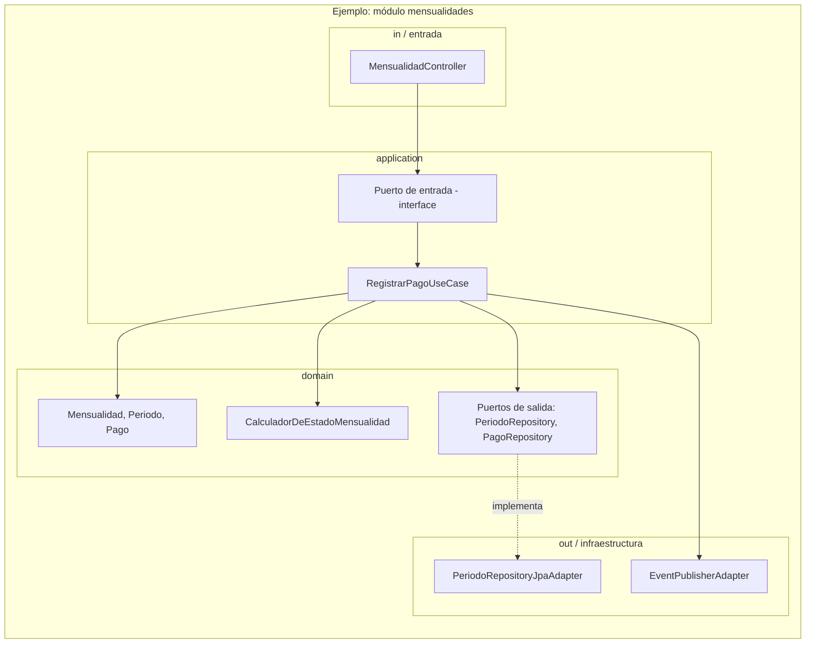

# FASE 4 — ARQUITECTURA

## 1. Decisión arquitectónica principal

**RECOMENDACIÓN: Modular Monolith + Arquitectura Hexagonal (Ports & Adapters)**, con Clean Architecture como criterio de organización interna de cada módulo.

### Evaluación de alternativas

| Opción | Evaluación |
|---|---|
| **Arquitectura en capas simple** | Insuficiente: mezcla fácilmente lógica de dominio con infraestructura si no se disciplina; no da fronteras claras entre BC1-BC6 definidos en Fase 2. |
| **Clean Architecture "pura"** | Válida, pero es más una filosofía de capas concéntricas que una estructura de módulos — la combino con Hexagonal para tener además fronteras explícitas de entrada/salida (puertos). |
| **Arquitectura Hexagonal** | **Elegida.** Aísla el dominio (reglas de negocio) de infraestructura (BD, HTTP, notificaciones) mediante puertos/adaptadores. Justificación real, no cosmética: ya identificamos reglas de negocio sensibles (cálculo de estado de periodo, cálculo de cobro, control de concurrencia de cupos) que **no deben depender de si persistimos en PostgreSQL o exponemos vía REST**. Poder testear esas reglas sin base de datos ni framework web es el problema real que resuelve. |
| **Modular Monolith** | **Elegida.** Los 6 bounded contexts (Fase 2) se implementan como módulos con fronteras de código explícitas dentro de un único desplegable, comunicándose por interfaces internas y eventos de dominio in-process. |
| **Microservicios** | **Descartada.** Con ~15 clientes reales y un solo parqueadero, no existe: (a) necesidad de escalar módulos de forma independiente, (b) equipos distintos por servicio, (c) necesidad de despliegues independientes. Microservicios aquí solo añadirían complejidad operativa (orquestación, resiliencia de red, consistencia eventual entre servicios) sin ningún problema real que resolver. Si el negocio crece a múltiples sedes/parqueaderos con alto volumen, esta decisión se puede revisar — hoy no se justifica (regla 8 de tus instrucciones originales). |

**Regla 21 (justificación obligatoria):** Modular Monolith + Hexagonal da el aislamiento de dominio que sí necesitamos (por las reglas de negocio identificadas) sin pagar el costo operativo de microservicios que no necesitamos. Es la combinación de menor complejidad que resuelve los problemas reales detectados en las Fases 1-3.

---

## 2. Diagrama de arquitectura general

```mermaid
flowchart TB
    subgraph Clientes["Clientes de la API"]
        WEB[App Web Admin/Operador]
    end

    subgraph API["Capa de Entrada (Adaptadores de entrada)"]
        REST[Controllers REST]
        AUTH[Filtro de Autenticación/Autorización]
    end

    subgraph APP["Capa de Aplicación (Casos de Uso)"]
        UC_CLI[Módulo Clientes]
        UC_MEN[Módulo Mensualidades]
        UC_MOV[Módulo Parqueo Transitorio]
        UC_TAR[Módulo Tarifas]
        UC_SEG[Módulo Seguridad/Auditoría]
        UC_REP[Módulo Reporting]
    end

    subgraph DOM["Capa de Dominio (núcleo, sin dependencias externas)"]
        ENT[Entidades / Value Objects / Agregados]
        SVC[Servicios de Dominio]
        EVT[Eventos de Dominio]
        PORTS_OUT[Puertos de salida - interfaces]
    end

    subgraph INFRA["Adaptadores de Salida (Infraestructura)"]
        REPO[Repositorios - JPA/Postgres]
        NOTIF[Adaptador de Notificaciones]
        AUDITLOG[Adaptador de Auditoría]
        BACKUP[Adaptador de Backups]
    end

    subgraph DB[(PostgreSQL)]
    end

    WEB --> REST
    REST --> AUTH
    AUTH --> UC_CLI & UC_MEN & UC_MOV & UC_TAR & UC_SEG & UC_REP
    UC_CLI & UC_MEN & UC_MOV & UC_TAR & UC_SEG & UC_REP --> ENT
    UC_CLI & UC_MEN & UC_MOV & UC_TAR & UC_SEG & UC_REP --> SVC
    SVC --> EVT
    ENT & SVC --> PORTS_OUT
    PORTS_OUT -.implementado por.-> REPO & NOTIF & AUDITLOG & BACKUP
    REPO --> DB
    EVT -.escuchado por.-> AUDITLOG
    EVT -.escuchado por.-> NOTIF
    EVT -.escuchado por.-> UC_REP
```

**Regla de dependencia (Dependency Inversion, principio D de SOLID):** las flechas de dominio hacia infraestructura **no existen** — el dominio define interfaces (`PORTS_OUT`: `ClienteRepository`, `PagoRepository`, `NotificadorPort`, etc.) y la infraestructura las implementa. El dominio nunca importa nada de `INFRA` ni de frameworks web/ORM.

---

## 3. Módulos (mapeados 1:1 a los bounded contexts de Fase 2)

| Módulo | Contiene | Depende de |
|---|---|---|
| **clientes** | `Cliente`, `Vehiculo`, `VehiculoClienteHistorial` | — (módulo base) |
| **mensualidades** | `Mensualidad`, `Periodo`, `Pago`, `AplicacionPago` | clientes, tarifas (vía puerto, no acoplamiento directo) |
| **parqueo-transitorio** | `Movimiento`, `CapacidadParqueadero` | clientes, tarifas |
| **tarifas** | `TarifaMensualidad`, `TarifaVisitante`, `TipoVehiculo` | — (módulo base, catálogo) |
| **seguridad** | `Usuario`, `Rol`, `Auditoria` | — (transversal, consumido por todos vía eventos/interceptor) |
| **reporting** | Proyecciones de solo lectura, `Dashboard`, `Reporte` | lee de mensualidades, parqueo-transitorio, tarifas (solo consultas, nunca escribe en otros módulos) |

**Regla de comunicación entre módulos:** un módulo nunca accede a las tablas de otro directamente (nada de JOIN cruzando módulos en el código de un módulo distinto). La comunicación es:
1. **Síncrona vía interfaz pública del módulo** (p. ej. `mensualidades` le pregunta a `tarifas` "¿cuál es la tarifa vigente?" a través de un puerto `ConsultarTarifaVigentePort`, no leyendo su tabla).
2. **Asíncrona vía eventos de dominio in-process** (p. ej. `PagoRegistrado` es escuchado por `seguridad` para auditar y por `reporting` para refrescar sus proyecciones), sin acoplar el módulo emisor a saber quién escucha.

Esto es justamente lo que permite, más adelante, extraer un módulo a microservicio si el negocio creciera lo suficiente — sin haber pagado ese costo hoy.

---

## 4. Estructura interna de cada módulo (Hexagonal + Clean)



Cada módulo sigue el mismo patrón interno: `in` (controladores/entrada) → `application` (casos de uso, orquestan sin contener reglas de negocio) → `domain` (entidades + servicios de dominio + puertos de salida, sin dependencias externas) → `out` (adaptadores que implementan los puertos).

**Regla 17/18 (evitar lógica de negocio en controllers/repositories):** los `Controller` solo traducen HTTP↔caso de uso; los `Repository` solo traducen dominio↔SQL. Toda regla de negocio (cálculo de estado, validación de cupo, cálculo de cobro) vive exclusivamente en `domain`.

---

## 5. Persistencia

- **Un único esquema de PostgreSQL**, con tablas agrupadas lógicamente por módulo (prefijo de esquema opcional: `clientes.*`, `mensualidades.*`, etc., o simplemente convención de nombres — se define en Fase 5).
- Cada módulo tiene sus propios repositorios (puertos de salida); ningún módulo comparte entidades JPA con otro.
- Migraciones versionadas (Flyway o Liquibase — se decide en Fase 8/DevOps) — nunca cambios manuales de esquema en producción.
- Transacciones: se definen a nivel de caso de uso (`@Transactional` en el borde de `application`, nunca dentro del dominio puro), cubriendo exactamente las operaciones atómicas ya identificadas en Fase 1-3 (ingreso+asignación de cupo; salida+cobro+pago+liberación de cupo; pago+aplicación a periodos+auditoría).

---

## 6. Seguridad (arquitectónicamente)

- **Autenticación:** JWT de acceso de corta duración + refresh token, validado en `AUTH` (filtro de entrada), antes de llegar a cualquier caso de uso.
- **Autorización (RBAC):** se resuelve como un **aspecto transversal** (interceptor/decorador) que verifica el rol del usuario contra el caso de uso solicitado, **no dentro de cada caso de uso individualmente** (evita duplicar la regla "el operador no puede X" en 10 lugares distintos — Open/Closed: agregar un nuevo caso de uso restringido no obliga a tocar código de autorización existente).
- **Auditoría:** implementada como **listener de eventos de dominio**, no como llamada explícita dentro de cada caso de uso — así ningún desarrollador puede "olvidar" auditar una operación crítica nueva si emite el evento correspondiente (Observer/Domain Events, justificado en la Fase 5 con el resto de patrones).
- Todo el detalle de JWT, expiración, hashing de contraseñas, rate limiting, CORS, etc. se especifica con precisión en la Fase 5 (Diseño técnico), donde sí corresponde bajar a ese nivel.

---

## 7. API

- **REST** sobre HTTP/JSON — no se justifica GraphQL ni gRPC para este alcance (evaluado y descartado por regla de no sobreingeniería).
- Un controlador por módulo, expuesto bajo su propio prefijo (`/api/clientes`, `/api/mensualidades`, `/api/parqueo`, `/api/tarifas`, `/api/seguridad`, `/api/reportes`), reflejando las fronteras de módulo — refuerza que no hay endpoints que mezclen responsabilidades de dos módulos.
- Formato de error estandarizado (estructura única para toda la API) — se detalla en Fase 5.

---

## 8. Infraestructura (vista preliminar, se detalla en Fase 8 — DevOps)

Dado el tamaño real del sistema, la propuesta preliminar es deliberadamente simple:

- Un solo contenedor de aplicación (el monolito modular) + un contenedor de PostgreSQL, orquestados con Docker Compose para desarrollo/staging.
- Sin necesidad de balanceador de carga, colas de mensajería externas (Kafka/RabbitMQ) ni caché distribuido (Redis) en el MVP — los eventos de dominio son in-process, no hay volumen que lo justifique.
- Backups: dump programado de PostgreSQL (detalle de frecuencia/retención en Fase 8).

Esto se desarrolla completo en la Fase correspondiente a DevOps; aquí solo dejo la coherencia de que la arquitectura elegida no exige infraestructura compleja.

---

## 9. Decisiones pendientes que siguen abiertas

Sin cambios — no bloquean esta fase: `[DECISIÓN PENDIENTE 2, 4, 8, 9, 11]`.

**`[DECISIÓN PENDIENTE 12]` (nueva, propia de esta fase):** ¿El sistema necesita interfaz web propia (frontend) dentro de este mismo esfuerzo, o el alcance actual es solo el backend/API? El documento de requerimientos menciona "Dashboard" y "Reportes" pero no aclara si implica una interfaz visual a construir o si es solo datos expuestos vía API para un frontend futuro. Esto no bloquea el diseño técnico del backend, pero sí afecta el backlog del MVP (Fase 6).

---
