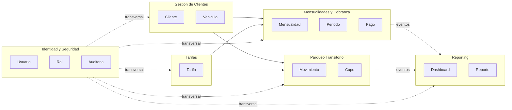
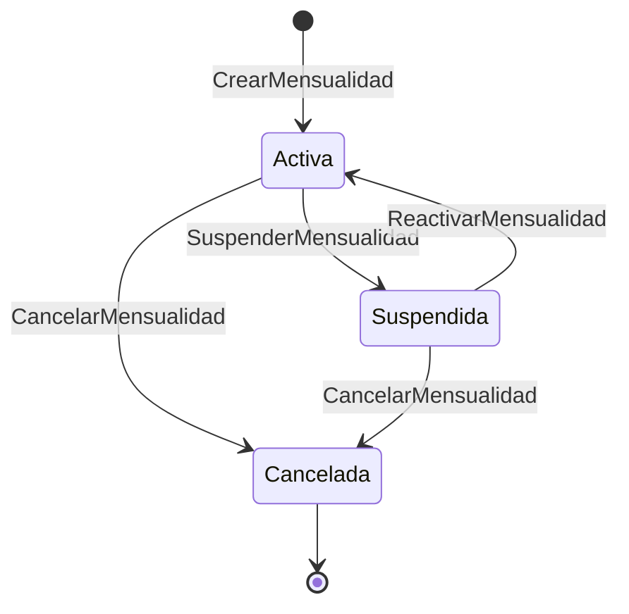
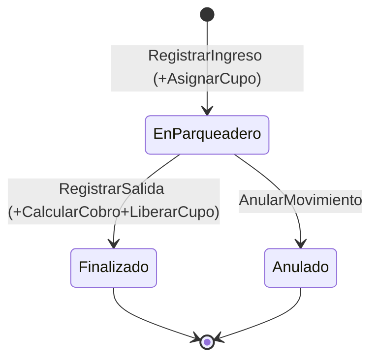

# Especificación Técnica y Funcional — Sistema de Gestión de Parqueadero

**Estado del documento:** Fases 1 a 6 aprobadas. Todas las decisiones pendientes que bloqueaban el MVP están resueltas. Pendiente iniciar Fase 7 — Implementación.

**Fuentes:** Excel actual de gestión (`Gestion_Parqueadero.xlsx`), documento de requerimientos del nuevo sistema, e información verbal de la dueña del parqueadero recopilada durante este proceso.

---

## Índice

1. [Fase 1 — Descubrimiento](#fase-1--descubrimiento)
2. [Fase 2 — Modelo de dominio](#fase-2--modelo-de-dominio)
3. [Fase 3 — Modelo de datos](#fase-3--modelo-de-datos)
4. [Fase 4 — Arquitectura](#fase-4--arquitectura)
5. [Fase 5 — Diseño técnico](#fase-5--diseño-técnico)
6. [Fase 6 — Backlog](#fase-6--backlog)
7. [Registro de Decisiones (ADR resumido)](#registro-de-decisiones-adr-resumido)
8. [Próximos pasos](#próximos-pasos)

---

## FASE 1 — Descubrimiento

### 1. Resumen del negocio

Parqueadero pequeño (~15 clientes mensuales activos, todos motos hasta ahora, capacidad total de **30 espacios de moto**) que opera principalmente con **mensualidades**. El Excel actual (`Gestion_Parqueadero.xlsx`) tiene una hoja por mes (Enero–Junio 2025), una hoja "Deudores", dos hojas con botones sin lógica funcional, y una hoja "Resumen Financiero" completamente vacía. El Excel **no cubre** parqueo por horas/visitantes, cupos, tarifas por hora, usuarios/roles, ni auditoría — todo eso es alcance **nuevo**, definido por el documento de requerimientos.

### 2. Proceso actual (según el Excel)

- Estructura por hoja mensual: `Nombre, Placa_Del_Vehiculo, Tipo_Vehiculo, Fecha_Ingreso, Fecha_vencimiento_pago, Estado_Del_Pago, Monto_Mensual, Monto_Pagado, Meses_Pendientes, Saldo_Pendiente, Metodo_De_Pago`.
- Cada mes se copia manualmente la lista de clientes del mes anterior, actualizando campos de pago.
- La hoja "Deudores" se alimenta manualmente y queda desincronizada frecuentemente respecto a las hojas mensuales.
- Los totales se calculan con `SUM()` al final de cada hoja — única automatización real presente.
- Sin validación de datos, sin formato condicional, sin comentarios: carga 100% manual y sin restricciones.

### 3. Problemas detectados en el Excel

| # | Hallazgo |
|---|---|
| A | `Estado_Del_Pago` es texto libre: `Ya pago`, `Pago`, `pago`, `Psgo`, `Pendiente`, vacíos. |
| B | `Metodo_De_Pago` inconsistente: mayúsculas/minúsculas/espacios mezclados, muchos vacíos. |
| C | Placas ausentes o inconsistentes en el tiempo para el mismo cliente. |
| D | `Tipo_Vehiculo` mezcla tipo y color (`MOTO (Rojo)`, `MOTO(Morada)`). |
| E | `Meses_Pendientes`/`Saldo_Pendiente` inconsistentes, a veces vacíos sin significar "sin deuda". |
| F | La hoja "Deudores" contradice el estado real de la hoja mensual del mismo período. |
| G | `Fecha_Ingreso` presente solo en algunos registros. |
| H | `Fecha_vencimiento_pago` no siempre corresponde al mes de la hoja. |
| I | Registros atípicos mal capturados (ej. "Fernando inquilino"). |
| J | Junio 2025 mayormente sin diligenciar (mes en curso al momento del corte). |
| K | Fila de totales mezclada con los datos de clientes. |
| L | Nombres de cliente no únicos, sin documento de identidad ni contacto. |
| M | Hoja "Resumen Financiero" vacía, nunca desarrollada. |
| N | Botones ("Actualizar Deudores", "Crear Hoja") sin lógica funcional en el archivo. |

### 4. Clasificación de la información del Excel

| Dato | Clasificación |
|---|---|
| Nombre, Placa, Tipo_Vehiculo | Información real del negocio (calidad deficiente) |
| Monto_Mensual, Metodo_De_Pago, Fecha pago | Información real del negocio |
| Estado_Del_Pago (texto libre) | Solución improvisada → debe ser estado derivado |
| Meses_Pendientes, Saldo_Pendiente | Dato derivado, hoy persistido a mano e inconsistente |
| Hoja mensual duplicada cliente por cliente | Redundante |
| Hoja "Deudores" | Redundante y desactualizable → debe ser consulta derivada |
| Fila de totales en la tabla de datos | No debe existir en el nuevo sistema |
| Documento de identidad, teléfono, correo | Falta — parcialmente resuelto (ver decisiones) |
| Cupos, tarifas por hora, ingreso/salida | Falta por completo — requerido por el documento de requerimientos |
| Usuarios, roles, permisos, auditoría | Falta por completo — requerido por el documento de requerimientos |

### 5. Requerimientos identificados

Módulos declarados: Clientes y vehículos; Mensualidades; Pagos; Deudores; Parqueo por horas/visitantes; Movimientos de entrada/salida; Cupos y espacios; Tarifas; Dashboard; Reportes; Usuarios; Roles; Permisos; Seguridad; Auditoría; Backups; Notificaciones.

---

## FASE 2 — Modelo de dominio

### 1. Actores

| Actor | Descripción |
|---|---|
| **Administrador** | Control total: tarifas, cupos, usuarios, configuración crítica, reportes. |
| **Operador** | Operación diaria: clientes/vehículos, pagos, ingresos/salidas. Sin permisos sobre tarifas, cupos, usuarios ni eliminación. |
| **Cliente mensual / Visitante** | Sujetos de datos, no actores del sistema (sin portal de autoservicio en esta etapa). |
| **Sistema de notificaciones** | Actor secundario externo. |
| **Sistema de backups** | Actor secundario de infraestructura. |
| **Reloj del sistema** | Dispara generación de periodos y vencimientos. |

### 2. Casos de uso principales

```mermaid
flowchart TB
    Admin[Administrador]
    Oper[Operador]

    subgraph Clientes y Vehículos
        UC1[RegistrarCliente]
        UC2[RegistrarVehiculo]
        UC3[ConsultarCliente]
    end

    subgraph Mensualidades y Pagos
        UC4[CrearMensualidad]
        UC5[GenerarPeriodoMensual]
        UC6[RegistrarPago]
        UC7[ConsultarEstadoCuenta]
        UC8[ConsultarDeudores]
        UC9[SuspenderMensualidad]
        UC10[CancelarMensualidad]
    end

    subgraph Parqueo por Horas
        UC11[RegistrarIngresoVisitante]
        UC12[RegistrarSalidaVisitante]
        UC13[CalcularCobro]
    end

    subgraph Cupos y Tarifas
        UC14[AsignarCupo]
        UC15[LiberarCupo]
        UC16[ConsultarOcupacion]
        UC17[ConfigurarTarifa]
        UC18[ConfigurarCapacidad]
    end

    subgraph Administración
        UC19[ConsultarDashboard]
        UC20[GenerarReporte]
        UC21[GestionarUsuarios]
        UC22[ConsultarAuditoria]
        UC23[RealizarBackup]
    end

    Oper --> UC1 & UC2 & UC3 & UC4 & UC6 & UC7 & UC8 & UC11 & UC12
    Admin --> UC5 & UC9 & UC10 & UC13 & UC14 & UC15 & UC16 & UC17 & UC18 & UC19 & UC20 & UC21 & UC22 & UC23
```



### 3. Bounded contexts (dentro de un modular monolith)



### 4. Clasificación DDD

| Concepto | Clasificación | Justificación |
|---|---|---|
| Cliente | Entidad (raíz de agregado) | Identidad propia (id interno), ciclo de vida largo |
| Vehículo | Entidad, dentro del agregado Cliente | Ciclo de vida ligado al dueño; conserva histórico ante cambios |
| Mensualidad | Entidad (raíz de agregado) | Estado y ciclo de vida propios: Activa / Suspendida / Cancelada |
| Periodo | Entidad, dentro del agregado Mensualidad | Representa un mes cubierto; sin campo de estado propio (se deriva) |
| Pago | Entidad (raíz de agregado propio) | Un pago puede cubrir varios periodos (vía `AplicacionPago`) |
| Deuda | **No es entidad** — vista/condición derivada | Periodo vencido con saldo > 0; nunca tabla separada |
| Movimiento | Entidad (raíz de agregado) | Una sola entidad con `hora_salida` nullable, cubre ingreso y salida |
| Cupo | Contador de capacidad (no entidad física individual) | Confirmado: no hay puestos numerados, solo capacidad total garantizada |
| Tarifa | Entidad versionada (raíz de agregado) | Nunca se sobrescribe; cambios generan nueva versión con vigencia |
| Usuario / Rol | Entidades de identidad y configuración | Rol es catálogo cerrado con permisos asociados (ver Fase 4) |
| Auditoria | Entidad de solo-append (inmutable) | Nunca se edita ni se borra |
| Notificación | Generada por eventos de dominio | Multicanal según datos disponibles del cliente |
| Reporte / Dashboard | Proyecciones de solo lectura | Sin ciclo de vida propio |
| TipoVehiculo | Catálogo abierto | Moto como principal, extensible a otros tipos |

**Servicios de dominio:** `CalculadorDeCobro` (Strategy por/día o por/hora), `CalculadorDeEstadoMensualidad`, `AsignadorDeCupo`, `GeneradorDePeriodos`.

**Eventos de dominio:** `ClienteRegistrado`, `VehiculoAsociado`, `MensualidadCreada`, `PeriodoGenerado`, `PagoRegistrado`, `PeriodoVencido`, `MensualidadSuspendida`, `MensualidadCancelada`, `VehiculoIngreso`, `VehiculoSalida`, `CupoAgotado`, `TarifaActualizada`, `UsuarioCreado`.

### 5. Estados

**Mensualidad:**


**Movimiento:**


**EstadoPeriodo** (calculado en consulta, nunca persistido como texto editable): `PENDIENTE`, `PARCIAL`, `PAGADO`, `EN_MORA`.

### 6. Reglas de negocio (RN)

| # | Regla |
|---|---|
| RN1 | Un cliente puede tener uno o más vehículos. |
| RN2 | Un vehículo pertenece a un único cliente a la vez, pero puede cambiar (con histórico). |
| RN3 | El cambio de placa conserva el historial de la placa anterior. |
| RN4 | Un `Periodo` vencido y no pagado se considera deuda; no existe entidad "Deuda" separada. |
| RN5 | Un `Pago` puede aplicarse a uno o varios `Periodo` (pago parcial, total o adelantado). |
| RN6 | Un cambio de `Tarifa` nunca altera cobros ya calculados con la tarifa anterior. |
| RN7 | Un cliente mensual con mensualidad activa tiene **acceso libre e ilimitado**, sin cobro por movimiento. |
| RN8 | El `Operador` no puede modificar tarifas, cupos, usuarios ni eliminar registros. |
| RN9 | Los registros financieros y de movimientos no se eliminan físicamente; se anulan o desactivan. |
| RN10 | Toda operación crítica genera un registro de auditoría inmutable. |
| RN11 | El estado de un `Periodo` se deriva de sus pagos y fecha de vencimiento; no se persiste como texto libre editable. |
| RN12 | La tarifa de visitantes por defecto es plana por **24 horas desde el ingreso** ($3.000 COP actual); el sistema soporta también modalidad por hora, configurable sin afectar tarifas históricas. |
| RN13 | Los montos de tarifa por día y por hora son configurables por el Administrador, no valores fijos en código. |
| RN14 | El sistema **no aplica recargos por mora**; la deuda se acumula mes a mes sin penalización hasta que el cliente pague (total o por abonos). |
| RN15 | Cancelar o suspender una mensualidad **no afecta ni condona** los periodos con saldo pendiente ya generados; siguen siendo cobrables indefinidamente. |
| RN16 | Una notificación se envía por todos los canales que el cliente tenga registrados (teléfono y/o correo); si no tiene ninguno, no se envía. |
| RN17 | La capacidad de 30 espacios de moto se ocupa tanto por mensualidades activas (espacio reservado permanente) como por visitantes presentes físicamente; no requiere numeración de puesto. |

---

## FASE 3 — Modelo de datos

### 1. Diagrama Entidad-Relación

```mermaid
erDiagram
    CLIENTE ||--o{ VEHICULO : "posee actualmente"
    CLIENTE ||--o{ VEHICULO_CLIENTE_HISTORIAL : "historial de tenencia"
    VEHICULO ||--o{ VEHICULO_CLIENTE_HISTORIAL : "registrado en"
    VEHICULO ||--o{ MENSUALIDAD : "tiene"
    CLIENTE ||--o{ MENSUALIDAD : "titular"
    TIPO_VEHICULO ||--o{ VEHICULO : "clasifica"
    TIPO_VEHICULO ||--o{ TARIFA_MENSUALIDAD : "aplica a"
    TIPO_VEHICULO ||--o{ TARIFA_VISITANTE : "aplica a"
    TIPO_VEHICULO ||--o{ CAPACIDAD_PARQUEADERO : "define"
    TARIFA_MENSUALIDAD ||--o{ MENSUALIDAD : "vigente al crear"
    MENSUALIDAD ||--o{ PERIODO : "genera"
    PERIODO ||--o{ APLICACION_PAGO : "recibe"
    PAGO ||--o{ APLICACION_PAGO : "se distribuye en"
    PAGO }o--o| MOVIMIENTO : "cobra (visitante)"
    TARIFA_VISITANTE ||--o{ MOVIMIENTO : "vigente al calcular"
    VEHICULO ||--o{ MOVIMIENTO : "protagoniza"
    TIPO_VEHICULO ||--o{ MOVIMIENTO : "clasifica"
    USUARIO ||--o{ PAGO : "registra"
    USUARIO ||--o{ MOVIMIENTO : "registra"
    USUARIO ||--o{ AUDITORIA : "genera"
    USUARIO }o--|| ROL : "tiene"
    ROL ||--o{ ROL_PERMISO : "otorga"
    PERMISO ||--o{ ROL_PERMISO : "otorgado en"

    CLIENTE {
        bigint id PK
        varchar documento_identidad UK "opcional"
        varchar tipo_documento "opcional"
        varchar nombre_completo
        varchar telefono "opcional"
        varchar correo_electronico "opcional"
        varchar direccion "opcional"
        timestamp fecha_registro
        boolean activo
        bigint creado_por FK
    }
    VEHICULO {
        bigint id PK
        varchar placa UK
        bigint tipo_vehiculo_id FK
        varchar color
        bigint cliente_id FK "nullable"
        boolean activo
    }
    VEHICULO_CLIENTE_HISTORIAL {
        bigint id PK
        bigint vehiculo_id FK
        bigint cliente_id FK
        timestamp fecha_inicio
        timestamp fecha_fin "nullable"
        bigint registrado_por FK
    }
    TIPO_VEHICULO {
        bigint id PK
        varchar nombre UK
        boolean activo
    }
    MENSUALIDAD {
        bigint id PK
        bigint vehiculo_id FK
        bigint cliente_id FK
        bigint tarifa_mensualidad_id FK
        numeric monto_mensual
        date fecha_inicio
        int dia_vencimiento
        varchar estado
        bigint creado_por FK
        timestamp fecha_creacion
    }
    PERIODO {
        bigint id PK
        bigint mensualidad_id FK
        date anio_mes
        numeric monto
        date fecha_vencimiento
        timestamp fecha_generacion
    }
    PAGO {
        bigint id PK
        numeric monto_total
        varchar origen
        bigint movimiento_id FK "nullable"
        timestamp fecha_pago
        varchar metodo_pago
        bigint registrado_por FK
        boolean anulado
        varchar motivo_anulacion
    }
    APLICACION_PAGO {
        bigint id PK
        bigint pago_id FK
        bigint periodo_id FK
        numeric monto_aplicado
    }
    TARIFA_MENSUALIDAD {
        bigint id PK
        bigint tipo_vehiculo_id FK
        numeric monto_mensual
        date vigencia_desde
        date vigencia_hasta "nullable"
        bigint creado_por FK
    }
    TARIFA_VISITANTE {
        bigint id PK
        bigint tipo_vehiculo_id FK
        varchar modalidad_cobro
        numeric monto_dia
        numeric monto_hora
        numeric tope_maximo_diario
        date vigencia_desde
        date vigencia_hasta "nullable"
        bigint creado_por FK
    }
    MOVIMIENTO {
        bigint id PK
        bigint vehiculo_id FK "nullable"
        varchar placa_capturada
        bigint tipo_vehiculo_id FK
        boolean es_cliente_mensual
        timestamp hora_ingreso
        timestamp hora_salida "nullable"
        bigint tarifa_visitante_id FK "nullable"
        numeric monto_cobrado "nullable"
        bigint registrado_por_ingreso FK
        bigint registrado_por_salida FK "nullable"
        boolean anulado
    }
    CAPACIDAD_PARQUEADERO {
        bigint id PK
        bigint tipo_vehiculo_id FK UK
        int capacidad_total
    }
    USUARIO {
        bigint id PK
        varchar nombre_usuario UK
        varchar password_hash
        bigint rol_id FK
        boolean activo
        timestamp fecha_creacion
        timestamp ultimo_login
    }
    ROL {
        bigint id PK
        varchar nombre UK
        boolean activo
    }
    PERMISO {
        bigint id PK
        varchar codigo UK
        varchar descripcion
    }
    ROL_PERMISO {
        bigint id PK
        bigint rol_id FK
        bigint permiso_id FK
    }
    AUDITORIA {
        bigint id PK
        bigint usuario_id FK
        varchar accion
        varchar entidad
        bigint entidad_id
        timestamp fecha_hora
        varchar resultado
        text detalle
    }
```

### 2. Notas clave del modelo

- **`Cliente.documento_identidad` es opcional** (único solo cuando está presente). El identificador de negocio estable es el **`id` interno autogenerado**, no el documento.
- **`Periodo` no tiene columna de estado ni saldo** — ambos se calculan en consulta a partir de sus `AplicacionPago` (RN11).
- **`Mensualidad.dia_vencimiento`** se fija una sola vez al crear la mensualidad (día del `fecha_inicio`), no hay un día de corte único para todo el parqueadero.
- **Capacidad (`CapacidadParqueadero`)**: el cálculo de ocupación efectiva combina mensualidades activas (espacio reservado permanente) + visitantes presentes físicamente (RN17):

```
Ocupación efectiva =
    COUNT(Mensualidad WHERE estado='ACTIVA' AND tipo_vehiculo=X)
  + COUNT(Movimiento WHERE hora_salida IS NULL AND tipo_vehiculo=X AND es_cliente_mensual=false)
```

- **`ROL`/`PERMISO`/`ROL_PERMISO`**: RBAC granular (patrón adoptado del proyecto Medical Management del usuario), permisos con convención `RECURSO_ACCION`. Asignación **solo por rol**, sin excepciones por usuario individual.
- **Denormalización intencional y justificada:** `Mensualidad.cliente_id` (titular al crear, aunque el vehículo cambie de dueño), `Mensualidad.monto_mensual`/`Periodo.monto` (snapshot de tarifa), `Movimiento.tarifa_visitante_id`+`monto_cobrado` (snapshot de cobro).

### 3. Constraints e índices clave

- `Vehiculo.placa` — UNIQUE.
- `Cliente.documento_identidad` — UNIQUE parcial (`WHERE documento_identidad IS NOT NULL`).
- `Mensualidad` — índice único parcial `(vehiculo_id) WHERE estado='ACTIVA'`.
- `Periodo` — UNIQUE `(mensualidad_id, anio_mes)`.
- `AplicacionPago` — UNIQUE `(pago_id, periodo_id)`.
- `TarifaMensualidad`/`TarifaVisitante` — `EXCLUDE USING gist` sin solapamiento de vigencia por tipo de vehículo.
- `Movimiento` — índice parcial `WHERE hora_salida IS NULL`.
- Todas las FK con `ON DELETE RESTRICT` (nunca `CASCADE` en datos financieros/históricos).

### 4. Motor de base de datos

**RECOMENDACIÓN: PostgreSQL** — soporte nativo de `EXCLUDE USING gist` con `daterange`, constraints parciales, sin costo de licenciamiento, más que suficiente para el volumen real del negocio.

### 5. Migración del Excel — mapeo preliminar

| Columna Excel | Destino | Tratamiento |
|---|---|---|
| Nombre | `Cliente.nombre_completo` | Documento de identidad ya no es obligatorio; se usa `id` interno |
| Placa_Del_Vehiculo | `Vehiculo.placa` | Normalizar formato; filas sin placa quedan pendientes de completar |
| Tipo_Vehiculo | `Vehiculo.tipo_vehiculo_id` + `Vehiculo.color` | Separar tipo de color (`"MOTO (Rojo)"` → tipo=MOTO, color=Rojo) |
| Fecha_Ingreso | `Mensualidad.fecha_inicio` | Confirmado: fecha de alta del cliente |
| Fecha_vencimiento_pago | `Periodo.fecha_vencimiento` | Confirmado: fecha límite de pago |
| Estado_Del_Pago | No se migra literal | Se reconstruye `EstadoPeriodo` desde `Monto_Pagado` vs `Monto_Mensual` |
| Monto_Mensual | `Mensualidad.monto_mensual` / `Periodo.monto` | |
| Monto_Pagado | `Pago.monto_total` + `AplicacionPago` | |
| Metodo_De_Pago | `Pago.metodo_pago` | Normalizar a catálogo cerrado (`EFECTIVO`/`TRANSFERENCIA`) |
| Hoja "Deudores" | No se migra como tabla | Se descarta; se recalcula desde `Periodo`+`Pago` migrados |

---

## FASE 4 — Arquitectura

### 1. Decisión arquitectónica

**Modular Monolith + Arquitectura Hexagonal (Ports & Adapters)**, con Clean Architecture como criterio de organización interna de cada módulo.

**Microservicios descartados explícitamente**: con ~15 clientes reales y un solo parqueadero, no hay necesidad de escalar módulos independientemente, ni equipos separados, ni despliegues independientes — solo añadiría complejidad operativa sin resolver un problema real.

### 2. Diagrama de arquitectura

```mermaid
flowchart TB
    subgraph Clientes["Clientes de la API"]
        WEB[App Web Admin/Operador - fase futura]
    end

    subgraph API["Capa de Entrada"]
        REST[Controllers REST]
        AUTH[Filtro Autenticación/Autorización]
    end

    subgraph APP["Capa de Aplicación (Casos de Uso)"]
        UC_CLI[Módulo Clientes]
        UC_MEN[Módulo Mensualidades]
        UC_MOV[Módulo Parqueo Transitorio]
        UC_TAR[Módulo Tarifas]
        UC_SEG[Módulo Seguridad/Auditoría]
        UC_REP[Módulo Reporting]
    end

    subgraph DOM["Capa de Dominio (núcleo)"]
        ENT[Entidades / Value Objects / Agregados]
        SVC[Servicios de Dominio]
        EVT[Eventos de Dominio]
        PORTS_OUT[Puertos de salida]
    end

    subgraph INFRA["Adaptadores de Salida"]
        REPO[Repositorios JPA/Postgres]
        NOTIF[Adaptador de Notificaciones]
        AUDITLOG[Adaptador de Auditoría]
        BACKUP[Adaptador de Backups]
    end

    subgraph DB[(PostgreSQL)]
    end

    WEB --> REST
    REST --> AUTH
    AUTH --> UC_CLI & UC_MEN & UC_MOV & UC_TAR & UC_SEG & UC_REP
    UC_CLI & UC_MEN & UC_MOV & UC_TAR & UC_SEG & UC_REP --> ENT
    UC_CLI & UC_MEN & UC_MOV & UC_TAR & UC_SEG & UC_REP --> SVC
    SVC --> EVT
    ENT & SVC --> PORTS_OUT
    PORTS_OUT -.implementado por.-> REPO & NOTIF & AUDITLOG & BACKUP
    REPO --> DB
    EVT -.escuchado por.-> AUDITLOG
    EVT -.escuchado por.-> NOTIF
    EVT -.escuchado por.-> UC_REP
```

### 3. Módulos

| Módulo | Contiene | Depende de |
|---|---|---|
| `clientes` | Cliente, Vehiculo, VehiculoClienteHistorial | — |
| `mensualidades` | Mensualidad, Periodo, Pago, AplicacionPago | clientes, tarifas (vía puerto) |
| `parqueo-transitorio` | Movimiento, CapacidadParqueadero | clientes, tarifas |
| `tarifas` | TarifaMensualidad, TarifaVisitante, TipoVehiculo | — |
| `seguridad` | Usuario, Rol, Permiso, Auditoria | transversal |
| `reporting` | Proyecciones de solo lectura, Dashboard, Reporte | lee de los demás (solo consulta) |

Comunicación entre módulos: **síncrona vía interfaz pública** o **asíncrona vía eventos de dominio in-process** — nunca acceso directo a tablas de otro módulo.

### 4. Seguridad — RBAC granular (patrón adoptado de Medical Management)

- Autenticación: JWT de acceso + refresh token.
- Autorización: verificación por **código de permiso** (`hasAuthority('PAGOS_CREATE')`), no por nombre de rol.
- Modelo: `Usuario` N:1 `Rol`, `Rol` N:M `Permiso` (tabla `RolPermiso`).
- Convención de permisos: `RECURSO_ACCION` (ej. `USUARIOS_READ`, `PAGOS_CREATE`, `TARIFAS_UPDATE`).
- Envelope estándar de respuesta API (`success`, `message`, `data`, `timestamp`), igual al usado en el proyecto de referencia del usuario.
- Auditoría implementada como listener de eventos de dominio (Observer), nunca como llamada explícita duplicada en cada caso de uso — enfoque **simple, in-process, sin patrón Outbox**.

### 5. Catálogo de permisos [RECOMENDACIÓN]

```
CLIENTES_READ/CREATE/UPDATE/DELETE
VEHICULOS_READ/CREATE/UPDATE/DELETE
MENSUALIDADES_READ/CREATE/UPDATE/DELETE
PAGOS_READ/CREATE/ANULAR
MOVIMIENTOS_READ/CREATE_INGRESO/CREATE_SALIDA/ANULAR
TARIFAS_READ/CREATE/UPDATE
CAPACIDAD_READ/UPDATE
USUARIOS_READ/CREATE/UPDATE/DELETE
ROLES_READ/CREATE/UPDATE
AUDITORIA_READ
REPORTES_READ
DASHBOARD_READ
BACKUPS_READ/CREATE
```

`ADMINISTRADOR`: todos los permisos. `OPERADOR`: todos los `_READ` + creación/actualización operativa, sin `TARIFAS_*`, `CAPACIDAD_UPDATE`, `USUARIOS_*`, `ROLES_*`, `_DELETE`, `PAGOS_ANULAR`, `MOVIMIENTOS_ANULAR`.

### 6. API y persistencia

- REST/JSON, un controlador por módulo bajo su propio prefijo (`/api/clientes`, `/api/mensualidades`, etc.).
- PostgreSQL, migraciones versionadas (Flyway/Liquibase).
- Transacciones a nivel de caso de uso, cubriendo exactamente las operaciones atómicas críticas (ingreso+cupo, salida+cobro+pago+liberación, pago+aplicación+auditoría).

### 7. Alcance de esta etapa

**Confirmado: solo backend por ahora.** El frontend se aborda en una fase posterior separada, una vez el backend tenga las funcionalidades principales completas. La arquitectura hexagonal ya deja la API lista para ser consumida por cualquier frontend futuro sin acoplamiento.

---

## FASE 5 — Diseño técnico

### 1. Patrones de diseño aplicados (justificados)

| Patrón | Problema que resuelve | Dónde |
|---|---|---|
| **Repository** | Dominio persiste/consulta sin conocer PostgreSQL/JPA | Un repositorio por agregado raíz |
| **Strategy** | Cálculo de cobro cambia según modalidad (`POR_DIA`/`POR_HORA`) | `EstrategiaCalculoCobro`, módulo parqueo-transitorio |
| **Specification** | Regla de `EstadoPeriodo` reutilizada en varios lugares (dashboard, deudores, estado de cuenta) | `domain` del módulo mensualidades |
| **Factory (método)** | Construcción válida de `Periodo` con snapshot de tarifa | `PeriodoFactory` |
| **Observer / Domain Events** | Auditoría, notificaciones y reporting reaccionan a hechos del dominio sin acoplarse | Transversal |
| **Chain of Responsibility (simplificado)** | Validaciones independientes de un request | Lista de `Validador<T>` iterada (sin maquinaria completa de chain) |
| **Dependency Injection** | Dominio no instancia directamente sus adaptadores | Inyección por constructor en todos los casos de uso |

**Descartados explícitamente (evitar sobreingeniería):** State (pocas transiciones, un enum basta), Builder (sin objetos de construcción compleja), Facade (los módulos ya exponen interfaz acotada), Template Method (sin algoritmos con variaciones que lo requieran).

### 2. Estructuras de datos

`Optional<T>`, `List<T>`, Enums cerrados (`EstadoMensualidad`, `ModalidadCobro`, `MetodoPago`, `OrigenPago`), Value Object `Dinero` (nunca `float`/`double`), DTOs/Records para entrada-salida de la API (nunca se expone la entidad de dominio directamente), `Specification<Periodo>`, paginación (`Page<T>`) en todos los listados que crecen con el tiempo.

### 3. Ejemplo de referencia — `RegistrarPago` (módulo mensualidades)

Value Object `Dinero`, entidad `Periodo` con `calcularEstado()`/`calcularSaldo()` (sin campos persistidos de estado/saldo), puertos `PeriodoRepository`/`PagoRepository`/`AplicacionPagoRepository`, DTOs `RegistrarPagoRequest`/`RegistrarPagoResponse`, validadores encadenados (monto positivo, periodos existen, no sobre-pago), y el caso de uso `RegistrarPagoUseCase` que:

1. Valida el request.
2. Crea el `Pago`.
3. Distribuye el monto entre los periodos seleccionados, del más antiguo al más reciente (RN5).
4. Publica el evento `PagoRegistrado` (consumido por auditoría y reporting).

Todo dentro de una transacción (`@Transactional`) a nivel de caso de uso.

### 4. Ejemplo — Strategy de cálculo de cobro (módulo parqueo-transitorio)

- `EstrategiaCalculoCobro` (interfaz).
- `CalculoCobroPorDia`: cobra por bloques de 24 horas desde el ingreso, redondeando hacia arriba, mínimo un día (RN12, confirmado por la dueña).
- `CalculoCobroPorHora`: cobra por fracción de hora con tope diario.
- `SelectorEstrategiaCalculoCobro`: elige la estrategia según la `ModalidadCobro` de la tarifa vigente.

### 5. Concurrencia — `RegistrarIngreso`

Bloqueo pesimista (`SELECT ... FOR UPDATE`) sobre el contador de capacidad al validar disponibilidad, evitando doble asignación por ingresos simultáneos. La ocupación efectiva combina mensualidades activas + visitantes presentes (RN17, corrección aplicada tras confirmar que el espacio de un cliente mensual está reservado permanentemente).

**Nota importante:** `CrearMensualidad` también valida cupo disponible (no solo `RegistrarIngreso`), porque una mensualidad activa reserva un espacio de los 30 aunque la moto esté físicamente afuera.

### 6. Formato estándar de error de API

```json
{
  "success": false,
  "message": "El monto del pago debe ser mayor a cero",
  "data": null,
  "errorCode": "MONTO_INVALIDO",
  "timestamp": "2026-08-21T10:15:30"
}
```

### 7. Validaciones — resumen

| Campo | Sintáctica | Estructural | Negocio |
|---|---|---|---|
| `documento_identidad` | Formato según tipo (si se diligencia) | Longitud, caracteres | UNIQUE solo si presente (campo opcional) |
| `placa` | Patrón regional | Mayúsculas, sin espacios | UNIQUE en BD |
| `monto` | Numérico | > 0, máx. 2 decimales | No excede saldo pendiente; nunca negativo |
| `fecha_vencimiento` | Formato fecha | Fecha válida | No anterior a `fecha_inicio` de la mensualidad |
| `hora_salida` | Timestamp | Posterior a `hora_ingreso` | — |

---

## FASE 6 — Backlog

### Epics

| ID | Epic | Prioridad |
|---|---|---|
| E1 | Seguridad y Acceso | Must |
| E2 | Gestión de Clientes y Vehículos | Must |
| E3 | Mensualidades y Cobranza | Must |
| E4 | Parqueo Transitorio | Must |
| E5 | Tarifas y Capacidad | Must |
| E6 | Dashboard y Reportes | Should (básico Must para MVP) |
| E7 | Auditoría | Must (transversal) |
| E8 | Notificaciones | Could |
| E9 | Backups y Recuperación | Should |
| E10 | Migración del Excel | Must (una sola vez) |

### Historias de usuario clave (MVP)

**E1 — Seguridad**
- HU-001 Login con JWT + roles/permisos.
- HU-002 Refresh token.
- HU-004 Crear usuarios operadores (Administrador).
- HU-005 Inactivar usuario (nunca borrar — RN9).
- HU-006 Crear roles y asignar permisos.
- HU-007 (técnica) Datos semilla de roles/permisos.

**E2 — Clientes y Vehículos**
- HU-008 Registrar cliente — **documento de identidad opcional**, `id` interno como identificador de negocio.
- HU-009 Asociar vehículos a un cliente (placa única, tipo + color separados).
- HU-010 Cambiar dueño de vehículo conservando historial.
- HU-011 Consultar clientes/vehículos (paginado).

**E3 — Mensualidades y Cobranza**
- HU-012 Crear mensualidad — **valida cupo disponible** (30 espacios moto, incluye mensualidades activas).
- HU-013 (técnica) Generar `Periodo` mensual automáticamente, snapshot de tarifa.
- HU-014 Registrar pago (total, parcial o cubriendo varios periodos).
- HU-015 Anular pago (Administrador, con motivo, sin borrado físico).
- HU-016 Consultar estado de cuenta (estado calculado, no editable).
- HU-017 Consultar deudores (vista derivada, no tabla).
- HU-018 Suspender/cancelar mensualidad — **la deuda queda activa y cobrable** hasta que se pague, total o por abonos (RN15), sin recargo por mora (RN14).

**E4 — Parqueo Transitorio**
- HU-019 Registrar ingreso — valida cupo, distingue cliente mensual (sin cobro) de visitante.
- HU-020 Registrar salida — calcula cobro solo para visitantes (24h desde ingreso, RN12), libera cupo.
- HU-021 Detectar vehículos sin salida registrada.
- HU-022 Anular movimiento erróneo.

**E5 — Tarifas y Capacidad**
- HU-023 Configurar tarifa mensual (snapshot, sin afectar histórico).
- HU-024 Configurar tarifa de visitantes (modalidad día/hora; semilla: $3.000 COP/día, moto).
- HU-025 Configurar capacidad total por tipo de vehículo (semilla: 30 motos). Sin numeración de puesto individual (confirmado).
- HU-026 Consultar ocupación actual.

**E6 — Dashboard**
- HU-027 Dashboard básico: ingresos del mes, mensualidades activas, deudores, ocupación actual.

**E7 — Auditoría**
- HU-030 Consultar auditoría filtrable.
- HU-031 (técnica) Auditoría automática vía eventos de dominio.

**E10 — Migración**
- HU-034 (técnica) Migrar datos del Excel con normalización y log de casos que requieren revisión manual.

### Historias fuera del MVP inmediato (Should/Could)

- HU-003 Logout explícito.
- HU-028 Reporte financiero por rango de fechas (reemplaza la hoja "Resumen Financiero" vacía).
- HU-029 Exportar reportes a PDF/Excel.
- HU-032 Notificaciones multicanal (teléfono/correo/ambos, según datos disponibles — RN16). Requiere definir proveedor técnico de envío antes de implementar.
- E9 Backups periódicos.

---

## Registro de Decisiones (ADR resumido)

| # | Decisión | Resolución final |
|---|---|---|
| 1 | Alcance de tipos de vehículo | Catálogo abierto; moto como principal, extensible |
| 2 | Significado de `Fecha_vencimiento_pago`/`Fecha_Ingreso` | Vencimiento = fecha límite de pago; Ingreso = fecha de alta del cliente |
| 3 | Automatización perdida en botones del Excel | Informativa, sin impacto en el diseño |
| 4 | Reglas numéricas (capacidad, mora) | Capacidad 30 motos; sin recargo por mora, deuda se acumula |
| 5 | Identificador único de cliente | **`id` interno**, documento de identidad opcional |
| 6 | Portal de autoservicio para clientes | Fuera de alcance por ahora |
| 7 | Ingreso/Salida como una o dos entidades | Una sola entidad `Movimiento` con `hora_salida` nullable |
| 8 | Cupos numerados vs. capacidad total | Solo capacidad total (30 motos), sin numeración de puesto |
| 9 | Cliente se retira con saldo pendiente | La deuda queda activa y cobrable indefinidamente |
| 10 | ¿Se registra `Movimiento` para clientes mensuales? | Sí, sin cobro asociado |
| 11 | "Día completo" — calendario vs. 24h | 24 horas desde el ingreso; posible franja día/noche a futuro |
| 12 | Alcance de frontend en este ciclo | Solo backend; frontend en fase posterior |
| 13 | Permisos por rol o por usuario individual | Solo por rol |
| 14 | Auditoría in-process vs. Outbox | In-process, simple |
| 15 | Canal de notificaciones | Multicanal según datos disponibles (teléfono y/o correo) |
| 16 | Número de puesto visible en el sistema | No necesario; basta con capacidad garantizada |

**Todas las decisiones que bloqueaban el MVP están resueltas.**

---

## Próximos pasos

Con las Fases 1 a 6 aprobadas y sin decisiones pendientes que bloqueen el MVP, el siguiente paso es la **Fase 7 — Implementación**, comenzando por el módulo `seguridad` (autenticación/autorización), del cual dependen operativamente todos los demás módulos, seguido de `clientes`, `tarifas`, `mensualidades` y `parqueo-transitorio` en ese orden de dependencia.

Cada implementación deberá indicar, según las reglas de trabajo definidas: requerimiento relacionado, historia de usuario, caso de uso, entidad, regla de negocio, archivos afectados, pruebas necesarias y riesgos — sin implementar funcionalidades no solicitadas.