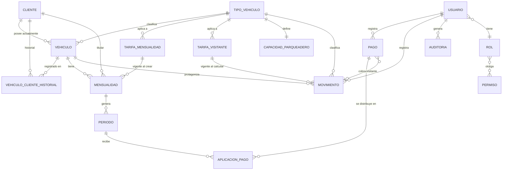

# Domain Model

> Archivo destinado a `docs/domain-model.md` en el repositorio del proyecto.
> Este documento es el blueprint de diseño. No contiene código Java de implementación.

**Nota de arquitectura (léase antes de continuar):** el diseño previo de este mismo sistema (fases de análisis anteriores) proponía una Arquitectura Hexagonal + Modular Monolith. Este documento adapta ese mismo modelo de dominio a una **arquitectura MVC en capas**, tal como se solicitó explícitamente para esta etapa inicial de construcción con Spring Boot. Las entidades, relaciones y reglas de negocio son las mismas; lo que cambia es la organización en capas (`controller/service/repository/model`) en lugar de módulos hexagonales con puertos y adaptadores. Esto se marca como `REQUERIDO` porque fue una instrucción explícita, y se deja anotado como `[DECISIÓN PENDIENTE]` al final si se desea evolucionar hacia Hexagonal más adelante.

---

## 1. Objetivo

Servir como guía técnica única para construir el modelo de dominio de un Sistema de Gestión de Parqueadero, de forma que un desarrollador pueda avanzar de manera progresiva y sin rediseñar:

```text
Entity → Repository → Service → DTO → Mapper → Controller → API
```

Este documento define **qué** construir y **por qué**, no el código final. Cada entidad, relación y regla está justificada por los requisitos reales del negocio (Excel de gestión actual + documento de requerimientos + información directa de la dueña del parqueadero), no por convención genérica de "cómo se hacen estos sistemas".

---

## 2. Arquitectura inicial

**REQUERIDO:** Arquitectura MVC en capas, monolito único, Spring Boot + Spring Web + Spring Data JPA + Hibernate + PostgreSQL + Maven.

```text
Controller → Service → Repository → Database
     ↓           ↓
   DTO       Entity (model/entity)
```

- **Controller**: recibe HTTP, valida forma del request (`@Valid`), delega al Service, traduce el resultado a DTO de respuesta. Sin lógica de negocio.
- **Service**: contiene los casos de uso y las reglas de negocio. Orquesta Repositories. Es la única capa que debe conocer las reglas de negocio del dominio.
- **Repository**: acceso a datos vía Spring Data JPA. Sin lógica de negocio, solo consultas.
- **Entity**: representa el modelo de dominio persistente. Puede contener comportamientos simples de validación/transición de estado propios del objeto (ver sección 9), pero no orquestación entre varias entidades (eso es responsabilidad del Service).
- **DTO/Mapper**: nunca se expone una entidad JPA directamente en la API.

No se introducen puertos/adaptadores ni separación por bounded context en esta etapa — es deliberadamente más simple que la propuesta Hexagonal previa, priorizando velocidad de construcción inicial (criterio de simplicidad, sección 21).

---

## 3. Convenciones

| Aspecto | Convención | Justificación |
|---|---|---|
| Identificadores | `Long` con `@GeneratedValue(strategy = GenerationType.IDENTITY)` en todas las entidades | Ver sección 6 |
| Nombres de tabla | `snake_case`, plural (`clientes`, `vehiculos`, `periodos`) | Convención estándar PostgreSQL/Hibernate |
| Nombres de columna | `snake_case` (`fecha_registro`, `documento_identidad`) | Idem |
| Atributos Java | `camelCase` | Convención Java |
| Fechas sin hora | `LocalDate` | Ej. `fechaInicio`, `vigenciaDesde` |
| Fechas con hora | `LocalDateTime` | Ej. `fechaRegistro`, `horaIngreso` |
| Dinero | `BigDecimal` (nunca `float`/`double`) | Precisión exacta obligatoria en montos financieros |
| Baja lógica | Campo `Boolean activo` (no `DELETE` físico) | Ninguna entidad de este dominio permite borrado físico (histórico y trazabilidad son requisitos explícitos) |
| Anulación de operaciones financieras | Campo `Boolean anulado` + motivo, nunca `DELETE` | Aplica a `Pago` y `Movimiento` |
| Auditoría de creación | Campo `creadoPor` (relación a `Usuario`) donde aplique | Trazabilidad de quién registró cada dato |

---

## 4. Entidades

### 4.1 Cliente

#### Responsabilidad

Representa a la persona titular de una o más mensualidades. Es el punto de entrada del negocio: todo vehículo con mensualidad activa pertenece a un cliente.

#### Atributos

| Atributo | Tipo Java | Obligatorio | Persistente | Descripción |
|---|---|---:|---:|---|
| id | Long | Sí | Sí | Identificador |
| documentoIdentidad | String | No | Sí | **PROPUESTO como opcional** — el identificador de negocio real es `id`, no el documento (decisión explícita del negocio) |
| tipoDocumento | TipoDocumento | No | Sí | Solo aplica si `documentoIdentidad` está presente |
| nombreCompleto | String | Sí | Sí | Nombre del cliente |
| telefono | String | No | Sí | Usado para notificaciones (RN-016) |
| correoElectronico | String | No | Sí | Usado para notificaciones (RN-016) |
| direccion | String | No | Sí | Opcional |
| fechaRegistro | LocalDateTime | Sí | Sí | Fecha de alta |
| activo | Boolean | Sí | Sí | Baja lógica, nunca `DELETE` |
| creadoPor | Usuario (relación) | Sí | Sí | Quién registró el cliente |

#### Métodos

| Método | Retorno | Parámetros | Responsabilidad |
|---|---|---|---|
| activar() | void | ninguno | Marca el cliente como activo |
| desactivar() | void | ninguno | Marca el cliente como inactivo (no elimina) |
| tieneCanalDeNotificacion() | boolean | ninguno | Indica si tiene teléfono y/o correo registrado, usado por el servicio de notificaciones (RN-016) |

#### Relaciones

- `Cliente` 1 ─── N `Vehiculo` (dueño actual)
- `Cliente` 1 ─── N `Mensualidad` (titular)
- `Cliente` 1 ─── N `VehiculoClienteHistorial`

#### Reglas de negocio

- Un cliente puede tener uno o más vehículos (RN-001).
- El documento de identidad, si se registra, debe ser único; si no se registra, no bloquea el alta (decisión de negocio confirmada).

---

### 4.2 TipoVehiculo

#### Responsabilidad

Catálogo abierto de tipos de vehículo admitidos (moto como principal hoy, extensible a otros sin cambio de esquema).

#### Atributos

| Atributo | Tipo Java | Obligatorio | Persistente | Descripción |
|---|---|---:|---:|---|
| id | Long | Sí | Sí | Identificador |
| nombre | String | Sí | Sí | Ej. `MOTO`, `CARRO` — único |
| activo | Boolean | Sí | Sí | Permite deshabilitar un tipo sin borrarlo |

#### Métodos

| Método | Retorno | Parámetros | Responsabilidad |
|---|---|---|---|
| activar() / desactivar() | void | ninguno | Habilita/deshabilita el tipo para nuevos registros |

#### Relaciones

- `TipoVehiculo` 1 ─── N `Vehiculo`
- `TipoVehiculo` 1 ─── N `TarifaMensualidad`
- `TipoVehiculo` 1 ─── N `TarifaVisitante`
- `TipoVehiculo` 1 ─── 1 `CapacidadParqueadero`

#### Reglas de negocio

- Catálogo abierto: no se codifica como enum en Java porque el negocio puede crecer a otros tipos sin requerir despliegue de código nuevo (decisión de Fase 2 del análisis previo).

---

### 4.3 Vehiculo

#### Responsabilidad

Representa un vehículo identificado por placa, asociado (o no) a un cliente.

#### Atributos

| Atributo | Tipo Java | Obligatorio | Persistente | Descripción |
|---|---|---:|---:|---|
| id | Long | Sí | Sí | Identificador |
| placa | String | Sí | Sí | Única en el sistema |
| tipoVehiculo | TipoVehiculo (relación) | Sí | Sí | Clasificación |
| color | String | No | Sí | Separado del tipo (corrige dato mezclado del Excel original) |
| cliente | Cliente (relación, nullable) | No | Sí | Puede ser `null` si el vehículo aún no tiene dueño registrado (ej. visitante ocasional) |
| activo | Boolean | Sí | Sí | Baja lógica |

#### Métodos

| Método | Retorno | Parámetros | Responsabilidad |
|---|---|---|---|
| activar() / desactivar() | void | ninguno | Baja lógica |
| tieneMensualidadActiva() | boolean | — | **PROPUESTO**, delegado normalmente al Service (requiere consultar `Mensualidad`); se documenta aquí como comportamiento conceptual, la implementación real vive en `MensualidadService` para no acoplar `Vehiculo` a un repositorio |

#### Relaciones

- `Vehiculo` N ─── 1 `Cliente` (opcional)
- `Vehiculo` N ─── 1 `TipoVehiculo` (obligatoria)
- `Vehiculo` 1 ─── N `Mensualidad`
- `Vehiculo` 1 ─── N `Movimiento`
- `Vehiculo` 1 ─── N `VehiculoClienteHistorial`

#### Reglas de negocio

- La placa es el identificador natural único del vehículo (RN-003 parcial).
- El cambio de dueño no sobrescribe `cliente`; genera un registro en `VehiculoClienteHistorial` (ver 4.4).

---

### 4.4 VehiculoClienteHistorial

#### Responsabilidad

Conserva el historial de tenencia de un vehículo cuando cambia de cliente, para no perder trazabilidad al sobrescribir `Vehiculo.cliente`.

#### Atributos

| Atributo | Tipo Java | Obligatorio | Persistente | Descripción |
|---|---|---:|---:|---|
| id | Long | Sí | Sí | Identificador |
| vehiculo | Vehiculo (relación) | Sí | Sí | Vehículo referenciado |
| cliente | Cliente (relación) | Sí | Sí | Cliente titular en ese período |
| fechaInicio | LocalDateTime | Sí | Sí | Inicio de la tenencia |
| fechaFin | LocalDateTime | No | Sí | `null` = tenencia vigente |
| registradoPor | Usuario (relación) | Sí | Sí | Trazabilidad |

#### Métodos

| Método | Retorno | Parámetros | Responsabilidad |
|---|---|---|---|
| cerrar(LocalDateTime fecha) | void | fecha de cierre | Marca `fechaFin`, usado cuando se registra un nuevo tenedor |

#### Relaciones

- `VehiculoClienteHistorial` N ─── 1 `Vehiculo`
- `VehiculoClienteHistorial` N ─── 1 `Cliente`

#### Reglas de negocio

- RN-002: un vehículo pertenece a un único cliente en un momento dado, pero puede cambiar (con histórico).
- RN-003: el cambio de placa o de dueño conserva el historial, nunca sobrescribe silenciosamente.

---

### 4.5 Mensualidad

#### Responsabilidad

Representa el contrato de acceso mensual entre un vehículo/cliente y el parqueadero. Es el agregado raíz del ciclo de cobranza mensual.

#### Atributos

| Atributo | Tipo Java | Obligatorio | Persistente | Descripción |
|---|---|---:|---:|---|
| id | Long | Sí | Sí | Identificador |
| vehiculo | Vehiculo (relación) | Sí | Sí | Vehículo cubierto |
| cliente | Cliente (relación) | Sí | Sí | **Denormalizado a propósito**: titular al momento de crear, aunque el vehículo cambie de dueño después |
| tarifaMensualidad | TarifaMensualidad (relación) | Sí | Sí | Tarifa vigente usada al crear |
| montoMensual | BigDecimal | Sí | Sí | Snapshot del monto; no se recalcula si la tarifa cambia (RN-006) |
| fechaInicio | LocalDate | Sí | Sí | Inicio de la mensualidad |
| diaVencimiento | Integer | Sí | Sí | Día del mes de vencimiento, fijado una sola vez (día de `fechaInicio`) |
| estado | EstadoMensualidad | Sí | Sí | Ver enum en sección 5 |
| creadoPor | Usuario (relación) | Sí | Sí | Trazabilidad |
| fechaCreacion | LocalDateTime | Sí | Sí | Auditoría |

#### Métodos

| Método | Retorno | Parámetros | Responsabilidad |
|---|---|---|---|
| activar() | void | ninguno | Transición `SUSPENDIDA → ACTIVA` |
| suspender() | void | ninguno | Transición `ACTIVA → SUSPENDIDA` |
| cancelar() | void | ninguno | Transición a `CANCELADA` (terminal); valida transición según enum |
| estaActiva() | boolean | ninguno | Consulta de estado actual |

Cada método de transición debe lanzar una excepción de dominio si la transición solicitada no es válida según el enum `EstadoMensualidad` (sección 5).

#### Relaciones

- `Mensualidad` N ─── 1 `Vehiculo`
- `Mensualidad` N ─── 1 `Cliente`
- `Mensualidad` N ─── 1 `TarifaMensualidad`
- `Mensualidad` 1 ─── N `Periodo`

#### Reglas de negocio

- Un vehículo no puede tener dos mensualidades `ACTIVA` simultáneas (constraint a nivel de base de datos, ver sección 8).
- RN-006: un cambio de tarifa nunca altera el `montoMensual` ya asignado.
- RN-015: cancelar o suspender una mensualidad no condona los periodos con saldo pendiente ya generados.
- RN-017: una mensualidad `ACTIVA` reserva un espacio de la capacidad total del tipo de vehículo, aunque el vehículo esté físicamente afuera (ver `CapacidadParqueadero`).

---

### 4.6 Periodo

#### Responsabilidad

Representa un mes específico cubierto por una `Mensualidad`, con su monto y vencimiento propios. **No almacena estado ni saldo** — ambos se calculan en tiempo de consulta a partir de sus `AplicacionPago`.

#### Atributos

| Atributo | Tipo Java | Obligatorio | Persistente | Descripción |
|---|---|---:|---:|---|
| id | Long | Sí | Sí | Identificador |
| mensualidad | Mensualidad (relación) | Sí | Sí | Mensualidad que lo genera |
| anioMes | LocalDate | Sí | Sí | Representa el mes cubierto (día 1 del mes). **PROPUESTO**: si se prefiere `YearMonth`, requiere un `AttributeConverter` personalizado (JPA no lo soporta nativamente); se documenta como alternativa técnica, no como decisión cerrada |
| monto | BigDecimal | Sí | Sí | Snapshot del monto de la mensualidad al generarse |
| fechaVencimiento | LocalDate | Sí | Sí | Fecha límite de pago |
| fechaGeneracion | LocalDateTime | Sí | Sí | Auditoría |
| aplicaciones | List\<AplicacionPago\> (relación, solo lectura conceptual) | No | No (derivado de la relación inversa) | Ver nota abajo |

**Nota:** `aplicaciones` se modela como `@OneToMany(mappedBy = "periodo")` únicamente para que los métodos de dominio puedan calcular estado/saldo sin depender del Service; no representa una columna propia.

#### Métodos

| Método | Retorno | Parámetros | Responsabilidad |
|---|---|---|---|
| calcularSaldo() | BigDecimal | ninguno | `monto` menos la suma de `montoAplicado` de sus aplicaciones |
| calcularEstado(LocalDate fechaActual) | EstadoPeriodo | fecha de referencia | Deriva `PENDIENTE`/`PARCIAL`/`PAGADO`/`EN_MORA` (RN-011) |

Estos son los dos métodos de dominio más importantes del sistema: reemplazan por completo el campo `Estado_Del_Pago` de texto libre que existía en el proceso manual anterior.

#### Relaciones

- `Periodo` N ─── 1 `Mensualidad`
- `Periodo` 1 ─── N `AplicacionPago`

#### Reglas de negocio

- RN-004: un `Periodo` vencido y no pagado se considera deuda; no existe una entidad "Deuda" separada.
- RN-011: el estado se deriva, nunca se persiste como texto editable.
- RN-014: no hay recargo por mora; la deuda solo se acumula.

---

### 4.7 Pago

#### Responsabilidad

Representa un hecho financiero de cobro, ya sea de mensualidad (puede cubrir uno o varios `Periodo`) o de parqueo transitorio (asociado a un `Movimiento`).

#### Atributos

| Atributo | Tipo Java | Obligatorio | Persistente | Descripción |
|---|---|---:|---:|---|
| id | Long | Sí | Sí | Identificador |
| montoTotal | BigDecimal | Sí | Sí | > 0 |
| origen | OrigenPago | Sí | Sí | `MENSUALIDAD` o `VISITANTE` |
| movimiento | Movimiento (relación, nullable) | No | Sí | Solo si `origen = VISITANTE` |
| fechaPago | LocalDateTime | Sí | Sí | |
| metodoPago | MetodoPago | Sí | Sí | Catálogo cerrado, ya no texto libre |
| registradoPor | Usuario (relación) | Sí | Sí | Trazabilidad |
| anulado | Boolean | Sí | Sí | Baja lógica |
| motivoAnulacion | String | No | Sí | Obligatorio solo si `anulado = true` (validación de negocio, no de columna) |

#### Métodos

| Método | Retorno | Parámetros | Responsabilidad |
|---|---|---|---|
| anular(String motivo) | void | motivo | Marca el pago como anulado; valida que `motivo` no esté vacío; nunca elimina el registro (RN-009) |

#### Relaciones

- `Pago` N ─── 1 `Movimiento` (opcional, solo pagos de visitante)
- `Pago` 1 ─── N `AplicacionPago`

#### Reglas de negocio

- RN-005: un pago puede aplicarse a uno o varios periodos.
- RN-009: los registros de pago nunca se eliminan físicamente.

---

### 4.8 AplicacionPago

#### Responsabilidad

Clase de asociación (entidad intermedia con atributo propio) que distribuye el monto de un `Pago` entre uno o varios `Periodo`.

#### Atributos

| Atributo | Tipo Java | Obligatorio | Persistente | Descripción |
|---|---|---:|---:|---|
| id | Long | Sí | Sí | Identificador |
| pago | Pago (relación) | Sí | Sí | |
| periodo | Periodo (relación) | Sí | Sí | |
| montoAplicado | BigDecimal | Sí | Sí | Porción del pago aplicada a este periodo |

#### Métodos

Sin métodos de dominio adicionales — es un registro inmutable una vez creado (no se edita, si un pago se anula, se anula el `Pago` completo, no la aplicación individual).

#### Relaciones

- `AplicacionPago` N ─── 1 `Pago`
- `AplicacionPago` N ─── 1 `Periodo`

#### Reglas de negocio

- RN-005: existe exclusivamente para permitir la relación N:M entre `Pago` y `Periodo` requerida por pagos parciales, totales o adelantados.

---

### 4.9 TarifaMensualidad

#### Responsabilidad

Tarifa versionada de mensualidad por tipo de vehículo. Nunca se edita una tarifa pasada; cada cambio crea una nueva versión.

#### Atributos

| Atributo | Tipo Java | Obligatorio | Persistente | Descripción |
|---|---|---:|---:|---|
| id | Long | Sí | Sí | Identificador |
| tipoVehiculo | TipoVehiculo (relación) | Sí | Sí | |
| montoMensual | BigDecimal | Sí | Sí | |
| vigenciaDesde | LocalDate | Sí | Sí | |
| vigenciaHasta | LocalDate | No | Sí | `null` = vigente actualmente |
| creadoPor | Usuario (relación) | Sí | Sí | |

#### Métodos

| Método | Retorno | Parámetros | Responsabilidad |
|---|---|---|---|
| estaVigente(LocalDate fecha) | boolean | fecha de referencia | Evalúa si la tarifa aplica en esa fecha |
| cerrarVigencia(LocalDate fecha) | void | fecha de cierre | Fija `vigenciaHasta`, usado al crear una nueva versión |

#### Relaciones

- `TarifaMensualidad` N ─── 1 `TipoVehiculo`
- `TarifaMensualidad` 1 ─── N `Mensualidad`

#### Reglas de negocio

- RN-006: no debe existir solapamiento de vigencia para el mismo tipo de vehículo (constraint de base de datos, sección 8).

---

### 4.10 TarifaVisitante

#### Responsabilidad

Tarifa versionada para parqueo transitorio (visitantes), con dos modalidades de cobro posibles.

#### Atributos

| Atributo | Tipo Java | Obligatorio | Persistente | Descripción |
|---|---|---:|---:|---|
| id | Long | Sí | Sí | Identificador |
| tipoVehiculo | TipoVehiculo (relación) | Sí | Sí | |
| modalidadCobro | ModalidadCobro | Sí | Sí | `POR_DIA` o `POR_HORA` |
| montoDia | BigDecimal | Condicional | Sí | Obligatorio si `modalidadCobro = POR_DIA`. Valor semilla actual: 3000 |
| montoHora | BigDecimal | Condicional | Sí | Obligatorio si `modalidadCobro = POR_HORA` |
| topeMaximoDiario | BigDecimal | Condicional | Sí | Obligatorio si `modalidadCobro = POR_HORA` |
| vigenciaDesde | LocalDate | Sí | Sí | |
| vigenciaHasta | LocalDate | No | Sí | |
| creadoPor | Usuario (relación) | Sí | Sí | |

#### Métodos

| Método | Retorno | Parámetros | Responsabilidad |
|---|---|---|---|
| estaVigente(LocalDate fecha) | boolean | fecha de referencia | Igual que `TarifaMensualidad` |
| cerrarVigencia(LocalDate fecha) | void | fecha de cierre | Igual que `TarifaMensualidad` |
| calcularCobro(LocalDateTime ingreso, LocalDateTime salida) | BigDecimal | ingreso, salida | Aplica la regla de la modalidad vigente (24h por bloque de día, o fracción de hora con tope) — RN-012 |

`calcularCobro` es el único método de entidad con lógica de cálculo relevante; se documenta aquí, aunque en la capa de Service puede envolverse en una `Strategy` si en el futuro se agregan más modalidades — no se introduce ese patrón todavía por no ser necesario con solo dos modalidades (evitar sobreingeniería).

#### Relaciones

- `TarifaVisitante` N ─── 1 `TipoVehiculo`
- `TarifaVisitante` 1 ─── N `Movimiento`

#### Reglas de negocio

- RN-012: modalidad `POR_DIA` cobra por bloques de 24 horas desde el ingreso, redondeando hacia arriba, mínimo un día. Valor actual del negocio: $3.000 COP/día para motos.
- RN-013: los montos son configurables por el Administrador, no valores fijos en código.

---

### 4.11 Movimiento

#### Responsabilidad

Registra el ingreso y (eventualmente) la salida de un vehículo del parqueadero — tanto de visitantes como de clientes mensuales con acceso libre.

#### Atributos

| Atributo | Tipo Java | Obligatorio | Persistente | Descripción |
|---|---|---:|---:|---|
| id | Long | Sí | Sí | Identificador |
| vehiculo | Vehiculo (relación, nullable) | No | Sí | `null` si es un vehículo no registrado previamente |
| placaCapturada | String | Sí | Sí | Siempre se captura, incluso sin `Vehiculo` asociado |
| tipoVehiculo | TipoVehiculo (relación) | Sí | Sí | |
| esClienteMensual | Boolean | Sí | Sí | Fijado al ingresar, según si el vehículo tiene mensualidad activa en ese momento |
| horaIngreso | LocalDateTime | Sí | Sí | |
| horaSalida | LocalDateTime | No | Sí | `null` = vehículo actualmente dentro |
| tarifaVisitante | TarifaVisitante (relación, nullable) | No | Sí | Solo si aplica cobro |
| montoCobrado | BigDecimal | No | Sí | Snapshot calculado al registrar salida |
| registradoPorIngreso | Usuario (relación) | Sí | Sí | |
| registradoPorSalida | Usuario (relación, nullable) | No | Sí | |
| anulado | Boolean | Sí | Sí | Baja lógica |

#### Métodos

| Método | Retorno | Parámetros | Responsabilidad |
|---|---|---|---|
| registrarSalida(LocalDateTime hora, BigDecimal monto, Usuario usuario) | void | hora, monto calculado, usuario | Fija `horaSalida`, `montoCobrado`, `registradoPorSalida`; valida que no tenga salida previa |
| estaDentro() | boolean | ninguno | `horaSalida == null` |
| anular(String motivo) | void | motivo | Baja lógica, nunca `DELETE` (RN-009) |

#### Relaciones

- `Movimiento` N ─── 1 `Vehiculo` (opcional)
- `Movimiento` N ─── 1 `TipoVehiculo`
- `Movimiento` N ─── 1 `TarifaVisitante` (opcional)
- `Movimiento` 1 ─── 0..1 `Pago` (opcional, solo visitantes cobrados)

#### Reglas de negocio

- RN-007: cliente mensual con mensualidad activa = acceso libre, sin cobro.
- El cálculo real de cobro y la validación de cupo disponible se orquestan en `MovimientoService`, no en la entidad (evita acoplar la entidad a repositorios de capacidad).

---

### 4.12 CapacidadParqueadero

#### Responsabilidad

Define la capacidad total configurada por tipo de vehículo. La ocupación **no se almacena** — se calcula combinando mensualidades activas y visitantes presentes.

#### Atributos

| Atributo | Tipo Java | Obligatorio | Persistente | Descripción |
|---|---|---:|---:|---|
| id | Long | Sí | Sí | Identificador |
| tipoVehiculo | TipoVehiculo (relación) | Sí | Sí | Única por tipo |
| capacidadTotal | Integer | Sí | Sí | Ej. 30 para moto |

#### Métodos

| Método | Retorno | Parámetros | Responsabilidad |
|---|---|---|---|
| actualizarCapacidad(int nuevaCapacidad) | void | nueva capacidad | Valida que sea positiva; la validación de que no sea menor a la ocupación actual se hace en el Service (requiere consultar otras entidades) |

#### Relaciones

- `CapacidadParqueadero` 1 ─── 1 `TipoVehiculo`

#### Reglas de negocio

- RN-017: ocupación efectiva = mensualidades activas del tipo + visitantes presentes del tipo. Este cálculo vive en `CapacidadService`, no en la entidad.

---

### 4.13 Usuario

#### Responsabilidad

Representa la identidad de acceso al sistema (Administrador u Operador).

#### Atributos

| Atributo | Tipo Java | Obligatorio | Persistente | Descripción |
|---|---|---:|---:|---|
| id | Long | Sí | Sí | Identificador |
| nombreUsuario | String | Sí | Sí | Único |
| passwordHash | String | Sí | Sí | Nunca texto plano |
| rol | Rol (relación) | Sí | Sí | |
| activo | Boolean | Sí | Sí | Baja lógica |
| fechaCreacion | LocalDateTime | Sí | Sí | |
| ultimoLogin | LocalDateTime | No | Sí | Actualizado en cada login exitoso |

#### Métodos

| Método | Retorno | Parámetros | Responsabilidad |
|---|---|---|---|
| activar() / desactivar() | void | ninguno | Baja lógica; un usuario inactivo no puede iniciar sesión |
| registrarLogin() | void | ninguno | Actualiza `ultimoLogin` |
| tienePermiso(String codigoPermiso) | boolean | código | Verifica si el rol del usuario incluye ese permiso |

#### Relaciones

- `Usuario` N ─── 1 `Rol`

#### Reglas de negocio

- RN-008: el Operador no puede modificar tarifas, cupos, usuarios ni eliminar registros — se aplica vía autorización basada en permisos (sección 17), no codificado en la entidad.

---

### 4.14 Rol

#### Responsabilidad

Agrupa un conjunto de permisos otorgables a usuarios (RBAC).

#### Atributos

| Atributo | Tipo Java | Obligatorio | Persistente | Descripción |
|---|---|---:|---:|---|
| id | Long | Sí | Sí | Identificador |
| nombre | String | Sí | Sí | Único, ej. `ADMINISTRADOR`, `OPERADOR` |
| activo | Boolean | Sí | Sí | |
| permisos | Set\<Permiso\> (relación) | No | Sí (tabla de unión) | Ver sección 8 |

#### Métodos

| Método | Retorno | Parámetros | Responsabilidad |
|---|---|---|---|
| asignarPermiso(Permiso permiso) | void | permiso | Agrega un permiso al rol |
| quitarPermiso(Permiso permiso) | void | permiso | Remueve un permiso del rol |
| tienePermiso(String codigo) | boolean | código | Verifica presencia de un permiso |

#### Relaciones

- `Rol` N ─── M `Permiso` (tabla de unión `rol_permiso`, sin atributos propios → **no requiere entidad de asociación**, se implementa como `@ManyToMany`)
- `Rol` 1 ─── N `Usuario`

#### Reglas de negocio

- Permisos asignados **solo por rol**, sin excepciones por usuario individual (decisión de negocio confirmada).

---

### 4.15 Permiso

#### Responsabilidad

Catálogo de capacidades otorgables, con convención `RECURSO_ACCION`.

#### Atributos

| Atributo | Tipo Java | Obligatorio | Persistente | Descripción |
|---|---|---:|---:|---|
| id | Long | Sí | Sí | Identificador |
| codigo | String | Sí | Sí | Único, ej. `PAGOS_CREATE` |
| descripcion | String | Sí | Sí | Texto legible |

#### Métodos

Sin métodos de dominio — es un catálogo de solo lectura para la aplicación (se administra vía datos semilla o `RolController`, no cambia en tiempo de ejecución de forma dinámica salvo por el Administrador).

#### Relaciones

- `Permiso` N ─── M `Rol`

---

### 4.16 Auditoria

#### Responsabilidad

Registro inmutable de operaciones críticas del sistema (login, pagos, ingresos/salidas, anulaciones, cambios de tarifa/capacidad, gestión de usuarios).

#### Atributos

| Atributo | Tipo Java | Obligatorio | Persistente | Descripción |
|---|---|---:|---:|---|
| id | Long | Sí | Sí | Identificador |
| usuario | Usuario (relación) | Sí | Sí | Quién ejecutó la acción |
| accion | String | Sí | Sí | Ej. `PAGO_REGISTRADO` |
| entidad | String | Sí | Sí | Nombre de la entidad afectada |
| entidadId | Long | Sí | Sí | Id del registro afectado |
| fechaHora | LocalDateTime | Sí | Sí | |
| resultado | String | Sí | Sí | `EXITO`/`FALLO` |
| detalle | String | No | Sí | Texto libre adicional (tipo `TEXT` en BD) |

#### Métodos

| Método | Retorno | Parámetros | Responsabilidad |
|---|---|---|---|
| `static registrar(...)` | Auditoria | usuario, acción, entidad, entidadId, resultado, detalle | Método de fábrica estático; no existen setters posteriores — la entidad es inmutable tras su creación |

#### Relaciones

- `Auditoria` N ─── 1 `Usuario`

#### Reglas de negocio

- RN-010: toda operación crítica genera un registro de auditoría inmutable. El usuario de aplicación de la base de datos no debe tener permiso `UPDATE`/`DELETE` sobre esta tabla (constraint operacional, ver sección 8).

---

## 5. Enumeraciones

### EstadoMensualidad

Valores: `ACTIVA`, `SUSPENDIDA`, `CANCELADA`

| Estado | Descripción |
|---|---|
| ACTIVA | Mensualidad vigente, con acceso libre para el cliente |
| SUSPENDIDA | Pausada temporalmente, puede reactivarse |
| CANCELADA | Terminal — no se puede reactivar |

Transiciones válidas: `ACTIVA → SUSPENDIDA`, `SUSPENDIDA → ACTIVA`, `ACTIVA → CANCELADA`, `SUSPENDIDA → CANCELADA`.
Transiciones inválidas: cualquier transición desde `CANCELADA`.

### EstadoPeriodo

Valores: `PENDIENTE`, `PARCIAL`, `PAGADO`, `EN_MORA`

**No es una columna persistida** — es el tipo de retorno del método `Periodo.calcularEstado()`. Se calcula, nunca se almacena como texto editable (RN-011).

| Estado | Condición |
|---|---|
| PENDIENTE | Sin pagos aplicados, aún no vencido |
| PARCIAL | Con pagos aplicados, saldo > 0, no vencido |
| PAGADO | Saldo = 0 |
| EN_MORA | Saldo > 0 y fecha actual > `fechaVencimiento` |

### ModalidadCobro

Valores: `POR_DIA`, `POR_HORA` — usado en `TarifaVisitante`.

### MetodoPago

Valores: `EFECTIVO`, `TRANSFERENCIA` — catálogo cerrado que reemplaza el texto libre del proceso manual anterior.

### OrigenPago

Valores: `MENSUALIDAD`, `VISITANTE` — determina cómo se distribuye un `Pago` (vía `AplicacionPago` o ligado a `Movimiento`).

### TipoDocumento

Valores `PROPUESTO`: `CC`, `CE`, `PASAPORTE`, `NIT`, `OTRO` — solo aplica si `Cliente.documentoIdentidad` está presente. **`[DECISIÓN PENDIENTE]`**: confirmar si esta lista cubre los casos reales del negocio.

---

## 6. Identificadores

**Decisión: `Long` con `IDENTITY` (secuencia autogenerada de PostgreSQL) para todas las entidades.**

| Opción | Evaluación |
|---|---|
| `Long` autogenerado | Simple, legible en logs/debugging, eficiente como índice de PostgreSQL (`BIGSERIAL`), suficiente para el volumen real del negocio (decenas de miles de registros en años, no millones) |
| `UUID` | Útil si se necesitara generar IDs en el cliente antes de persistir, exponer IDs no adivinables públicamente, o sincronizar entre sistemas distribuidos — **ninguno de estos casos aplica hoy** |

**Recomendación:** `Long` en todas las entidades. No se introduce `UUID` por no existir un problema real que lo justifique (criterio de simplicidad, sección 21). Si en el futuro se requiere exponer identificadores no adivinables en la API pública, se puede introducir un campo adicional (`publicId: UUID`) sin cambiar la clave primaria.

---

## 7. Relaciones entre entidades

### Cliente → Vehiculo

```text
Cliente 1 ─── N Vehiculo
```

Un cliente puede tener varios vehículos; un vehículo tiene como máximo un cliente actual (puede no tener ninguno). Relación opcional del lado de `Vehiculo`.

Implementación prevista: `Vehiculo.cliente → @ManyToOne(optional = true)`. **No bidireccional**: `Cliente` no necesita una colección `List<Vehiculo>` cargada por defecto; si se necesita listar los vehículos de un cliente, se hace vía `VehiculoRepository.findByClienteId(...)`, evitando el riesgo de colecciones grandes cargadas innecesariamente.

### Cliente → Mensualidad

```text
Cliente 1 ─── N Mensualidad
```

Relación unidireccional: `Mensualidad.cliente → @ManyToOne(optional = false)`.

### Vehiculo → Mensualidad

```text
Vehiculo 1 ─── N Mensualidad (histórico), máximo 1 ACTIVA a la vez
```

`Mensualidad.vehiculo → @ManyToOne(optional = false)`. La restricción de "máximo una activa" se implementa como constraint de base de datos (índice único parcial), no como relación JPA.

### Vehiculo / Cliente → VehiculoClienteHistorial

```text
Vehiculo 1 ─── N VehiculoClienteHistorial
Cliente  1 ─── N VehiculoClienteHistorial
```

Ambas `@ManyToOne(optional = false)` desde `VehiculoClienteHistorial`. Unidireccional desde el historial hacia sus referencias.

### Mensualidad → Periodo

```text
Mensualidad 1 ─── N Periodo
```

`Periodo.mensualidad → @ManyToOne(optional = false)`. Unidireccional (no se necesita `Mensualidad.periodos` cargado por defecto).

### Periodo ←→ Pago (vía AplicacionPago)

```text
Periodo N ─── M Pago
```

Resuelto mediante la entidad de asociación `AplicacionPago`, porque tiene atributo propio (`montoAplicado`) y porque un pago puede cubrir varios periodos (RN-005). `AplicacionPago.periodo → @ManyToOne`, `AplicacionPago.pago → @ManyToOne`. `Periodo.aplicaciones` se expone como `@OneToMany(mappedBy = "periodo")` **solo de lectura**, necesario para los métodos de dominio de la entidad (`calcularSaldo`, `calcularEstado`).

### Pago → Movimiento

```text
Pago N ─── 0..1 Movimiento
```

`Pago.movimiento → @ManyToOne(optional = true)`. Solo aplica cuando `origen = VISITANTE`.

### TipoVehiculo → Vehiculo / TarifaMensualidad / TarifaVisitante / CapacidadParqueadero / Movimiento

```text
TipoVehiculo 1 ─── N Vehiculo
TipoVehiculo 1 ─── N TarifaMensualidad
TipoVehiculo 1 ─── N TarifaVisitante
TipoVehiculo 1 ─── 1 CapacidadParqueadero
TipoVehiculo 1 ─── N Movimiento
```

Todas `@ManyToOne(optional = false)` desde el lado "muchos". Unidireccionales.

### TarifaMensualidad → Mensualidad

```text
TarifaMensualidad 1 ─── N Mensualidad
```

`Mensualidad.tarifaMensualidad → @ManyToOne(optional = false)`.

### TarifaVisitante → Movimiento

```text
TarifaVisitante 1 ─── N Movimiento
```

`Movimiento.tarifaVisitante → @ManyToOne(optional = true)` (solo si hubo cobro).

### Vehiculo → Movimiento

```text
Vehiculo 1 ─── N Movimiento
```

`Movimiento.vehiculo → @ManyToOne(optional = true)` (puede ser `null` si el vehículo no estaba registrado).

### Usuario → Rol

```text
Usuario N ─── 1 Rol
```

`Usuario.rol → @ManyToOne(optional = false)`.

### Rol ←→ Permiso

```text
Rol N ─── M Permiso
```

`@ManyToMany` directo (sin entidad de asociación, ya que `rol_permiso` no tiene atributos propios). Se expone desde `Rol.permisos`; no se necesita la colección inversa en `Permiso`.

### Usuario → (Cliente, VehiculoClienteHistorial, Mensualidad, Pago, Movimiento, Auditoria)

```text
Usuario 1 ─── N <cada una de estas entidades vía campo creadoPor/registradoPor*>
```

Todas unidireccionales `@ManyToOne(optional = false)` desde la entidad hacia `Usuario` — trazabilidad de quién ejecutó cada operación. `Usuario` no necesita colecciones inversas de todas estas (evitaría un objeto `Usuario` sobrecargado de relaciones que no se consultan desde ahí).

**Regla general de bidireccionalidad aplicada en todo el documento:** ninguna relación es bidireccional salvo que exista una necesidad real de navegar en ambos sentidos desde el modelo de dominio (aquí no se identificó ninguna). Todas las consultas inversas se resuelven vía métodos de Repository (`findByXxxId`).

---

## 8. JPA — anotaciones, tablas y constraints previstos

| Entidad | Tabla | Anotaciones clave | Constraints / índices |
|---|---|---|---|
| Cliente | `clientes` | `@Entity @Table(name="clientes") @Id @GeneratedValue(strategy=IDENTITY)` | `UNIQUE(documento_identidad)` parcial (`WHERE documento_identidad IS NOT NULL`) |
| TipoVehiculo | `tipos_vehiculo` | idem | `UNIQUE(nombre)` |
| Vehiculo | `vehiculos` | `@ManyToOne @JoinColumn(name="tipo_vehiculo_id")`, `@ManyToOne @JoinColumn(name="cliente_id", nullable=true)` | `UNIQUE(placa)`, FK a `tipos_vehiculo`, FK a `clientes` |
| VehiculoClienteHistorial | `vehiculo_cliente_historial` | `@ManyToOne @JoinColumn(name="vehiculo_id")`, `@ManyToOne @JoinColumn(name="cliente_id")` | FKs, índice por `vehiculo_id` |
| Mensualidad | `mensualidades` | `@ManyToOne @JoinColumn(name="vehiculo_id")`, `@ManyToOne @JoinColumn(name="cliente_id")`, `@ManyToOne @JoinColumn(name="tarifa_mensualidad_id")`, `@Enumerated(EnumType.STRING)` en `estado` | Índice único parcial `(vehiculo_id) WHERE estado='ACTIVA'`, FKs |
| Periodo | `periodos` | `@ManyToOne @JoinColumn(name="mensualidad_id")`, `@OneToMany(mappedBy="periodo")` | `UNIQUE(mensualidad_id, anio_mes)` |
| Pago | `pagos` | `@ManyToOne @JoinColumn(name="movimiento_id", nullable=true)`, `@Enumerated(EnumType.STRING)` en `origen` y `metodoPago` | `CHECK(monto_total > 0)` |
| AplicacionPago | `aplicaciones_pago` | `@ManyToOne @JoinColumn(name="pago_id")`, `@ManyToOne @JoinColumn(name="periodo_id")` | `UNIQUE(pago_id, periodo_id)` |
| TarifaMensualidad | `tarifas_mensualidad` | `@ManyToOne @JoinColumn(name="tipo_vehiculo_id")` | `EXCLUDE USING gist` sin solapamiento de vigencia por `tipo_vehiculo_id` (PostgreSQL) |
| TarifaVisitante | `tarifas_visitante` | idem + `@Enumerated(EnumType.STRING)` en `modalidadCobro` | idem |
| Movimiento | `movimientos` | `@ManyToOne` a `Vehiculo` (nullable), `TipoVehiculo`, `TarifaVisitante` (nullable) | Índice parcial `WHERE hora_salida IS NULL` |
| CapacidadParqueadero | `capacidad_parqueadero` | `@ManyToOne @JoinColumn(name="tipo_vehiculo_id")` | `UNIQUE(tipo_vehiculo_id)` |
| Usuario | `usuarios` | `@ManyToOne @JoinColumn(name="rol_id")` | `UNIQUE(nombre_usuario)` |
| Rol | `roles` | `@ManyToMany @JoinTable(name="rol_permiso", joinColumns=@JoinColumn(name="rol_id"), inverseJoinColumns=@JoinColumn(name="permiso_id"))` | `UNIQUE(nombre)` |
| Permiso | `permisos` | — | `UNIQUE(codigo)` |
| Auditoria | `auditoria` | `@ManyToOne @JoinColumn(name="usuario_id")` | Sin permisos `UPDATE`/`DELETE` para el rol de aplicación de BD (configuración de infraestructura, fuera de JPA) |

Todas las relaciones `@ManyToOne` obligatorias deben usar `FetchType.LAZY` explícito (evitar el `EAGER` por defecto de `@ManyToOne` en Hibernate) para no cargar grafos completos innecesariamente.

Todas las FK deben crearse con `ON DELETE RESTRICT` a nivel de base de datos — coherente con que ninguna entidad de este dominio permite borrado físico.

---

## 9. Métodos de las entidades

### Métodos de dominio (comportamientos reales)

```text
Cliente.activar() / desactivar()
Vehiculo.activar() / desactivar()
VehiculoClienteHistorial.cerrar(fecha)
Mensualidad.activar() / suspender() / cancelar() / estaActiva()
Periodo.calcularSaldo() / calcularEstado(fecha)
Pago.anular(motivo)
Movimiento.registrarSalida(hora, monto, usuario) / estaDentro() / anular(motivo)
TarifaMensualidad.estaVigente(fecha) / cerrarVigencia(fecha)
TarifaVisitante.estaVigente(fecha) / cerrarVigencia(fecha) / calcularCobro(ingreso, salida)
CapacidadParqueadero.actualizarCapacidad(nueva)
Usuario.activar() / desactivar() / registrarLogin() / tienePermiso(codigo)
Rol.asignarPermiso(permiso) / quitarPermiso(permiso) / tienePermiso(codigo)
Auditoria.registrar(...) [factory estático]
```

### Métodos técnicos (no representan comportamiento del dominio)

```text
getters / setters
constructores (incluyendo constructor protegido sin argumentos requerido por JPA)
equals() / hashCode() — basados en id, nunca en todos los campos (evita problemas con entidades JPA lazy)
toString() — opcional, útil para logging, sin incluir relaciones lazy para evitar N+1 accidental
```

---

## 10. Estructura de paquetes

```text
src/main/java/com/parqueadero/gestion/

├── controller/          # Entrada HTTP, traduce Request/Response, sin lógica de negocio
├── service/             # Casos de uso y reglas de negocio
├── repository/          # Interfaces Spring Data JPA
├── model/
│   ├── entity/          # Entidades JPA
│   └── enums/           # Enumeraciones del dominio
├── dto/
│   ├── request/         # DTOs de entrada
│   └── response/        # DTOs de salida
├── mapper/              # Entity ↔ DTO
├── exception/           # Excepciones de dominio + GlobalExceptionHandler
├── config/              # Configuración Spring (seguridad, CORS, OpenAPI, etc.)
└── security/            # JWT, filtros de autenticación/autorización
```

No se subdivide por módulo de dominio (`clientes/`, `mensualidades/`, etc.) en esta etapa inicial — se mantiene la estructura por capa técnica, más simple de navegar para un proyecto que empieza. Si el proyecto crece significativamente, se puede reorganizar por feature dentro de cada capa (`service/mensualidad/`, `service/parqueo/`) sin cambiar la arquitectura general.

---

## 11. Repositories

Solo se listan métodos de consulta justificados por un caso de uso real (no CRUD genérico inventado; `JpaRepository` ya cubre `save`, `findById`, `deleteById` — aunque `deleteById` no debe usarse dado que no hay borrado físico en este dominio).

| Repository | Métodos específicos necesarios |
|---|---|
| `ClienteRepository extends JpaRepository<Cliente, Long>` | `findByDocumentoIdentidad(String)`, `existsByDocumentoIdentidad(String)`, `findByNombreCompletoContainingIgnoreCase(String, Pageable)` |
| `TipoVehiculoRepository extends JpaRepository<TipoVehiculo, Long>` | `findByNombre(String)`, `findByActivoTrue()` |
| `VehiculoRepository extends JpaRepository<Vehiculo, Long>` | `findByPlaca(String)`, `existsByPlaca(String)`, `findByClienteId(Long)` |
| `VehiculoClienteHistorialRepository extends JpaRepository<VehiculoClienteHistorial, Long>` | `findByVehiculoIdOrderByFechaInicioDesc(Long)` |
| `MensualidadRepository extends JpaRepository<Mensualidad, Long>` | `findByVehiculoIdAndEstado(Long, EstadoMensualidad)`, `countByEstadoAndVehiculo_TipoVehiculo_Id(EstadoMensualidad, Long)` (usado en cálculo de capacidad efectiva), `findByEstado(EstadoMensualidad, Pageable)` |
| `PeriodoRepository extends JpaRepository<Periodo, Long>` | `findByMensualidadId(Long)`, `existsByMensualidadIdAndAnioMes(Long, LocalDate)` |
| `PagoRepository extends JpaRepository<Pago, Long>` | Sin métodos adicionales identificados aún — se accede principalmente por id |
| `AplicacionPagoRepository extends JpaRepository<AplicacionPago, Long>` | `findByPeriodoId(Long)`, `findByPagoId(Long)` |
| `TarifaMensualidadRepository extends JpaRepository<TarifaMensualidad, Long>` | Consulta personalizada `@Query` para tarifa vigente por tipo de vehículo y fecha |
| `TarifaVisitanteRepository extends JpaRepository<TarifaVisitante, Long>` | Idem |
| `MovimientoRepository extends JpaRepository<Movimiento, Long>` | `findByHoraSalidaIsNull()`, `countByTipoVehiculo_IdAndHoraSalidaIsNullAndEsClienteMensualFalse(Long)` (usado en cálculo de capacidad efectiva), `findByVehiculoIdOrderByHoraIngresoDesc(Long)` |
| `CapacidadParqueaderoRepository extends JpaRepository<CapacidadParqueadero, Long>` | `findByTipoVehiculoId(Long)` |
| `UsuarioRepository extends JpaRepository<Usuario, Long>` | `findByNombreUsuario(String)`, `existsByNombreUsuario(String)` |
| `RolRepository extends JpaRepository<Rol, Long>` | `findByNombre(String)` |
| `PermisoRepository extends JpaRepository<Permiso, Long>` | `findByCodigo(String)` |
| `AuditoriaRepository extends JpaRepository<Auditoria, Long>` | `findByUsuarioIdAndFechaHoraBetween(Long, LocalDateTime, LocalDateTime, Pageable)`, `findByEntidadAndEntidadId(String, Long)` |

---

## 12. Services

| Service | Responsabilidad | Métodos principales | Entidades involucradas | Repositories utilizados |
|---|---|---|---|---|
| `ClienteService` | Alta, consulta y baja lógica de clientes | `crearCliente()`, `consultarCliente()`, `buscarClientes()`, `desactivarCliente()` | Cliente | ClienteRepository |
| `VehiculoService` | Alta de vehículos, cambio de dueño con historial | `crearVehiculo()`, `cambiarDueno()`, `consultarPorPlaca()` | Vehiculo, VehiculoClienteHistorial, Cliente | VehiculoRepository, VehiculoClienteHistorialRepository |
| `TarifaService` | Configuración de tarifas mensuales y de visitante, versionado sin solapamiento | `configurarTarifaMensualidad()`, `configurarTarifaVisitante()`, `obtenerTarifaVigente()` | TarifaMensualidad, TarifaVisitante | TarifaMensualidadRepository, TarifaVisitanteRepository |
| `MensualidadService` | Ciclo de vida de mensualidades, generación de periodos, validación de cupo al crear | `crearMensualidad()`, `suspenderMensualidad()`, `cancelarMensualidad()`, `generarPeriodoMensual()` | Mensualidad, Periodo, Vehiculo, TarifaMensualidad | MensualidadRepository, PeriodoRepository, TarifaMensualidadRepository, CapacidadService |
| `PagoService` | Registro y anulación de pagos, distribución entre periodos (RN-005) | `registrarPago()`, `anularPago()`, `consultarEstadoCuenta()`, `consultarDeudores()` | Pago, AplicacionPago, Periodo | PagoRepository, AplicacionPagoRepository, PeriodoRepository |
| `MovimientoService` | Ingreso/salida de vehículos, cálculo de cobro, validación de cupo | `registrarIngreso()`, `registrarSalida()`, `anularMovimiento()`, `listarVehiculosSinSalida()` | Movimiento, Vehiculo, TarifaVisitante, Pago | MovimientoRepository, TarifaVisitanteRepository, CapacidadService, PagoRepository |
| `CapacidadService` | Configuración de capacidad y cálculo de ocupación efectiva (mensualidades activas + visitantes presentes, RN-017) | `configurarCapacidad()`, `consultarOcupacion()`, `hayCupoDisponible(tipoVehiculoId)` | CapacidadParqueadero, Mensualidad, Movimiento | CapacidadParqueaderoRepository, MensualidadRepository, MovimientoRepository |
| `UsuarioService` | Gestión de usuarios y autenticación | `crearUsuario()`, `desactivarUsuario()`, `autenticar()`, `refrescarToken()` | Usuario, Rol | UsuarioRepository, RolRepository |
| `RolService` | Gestión de roles y permisos | `crearRol()`, `asignarPermisos()`, `listarPermisos()` | Rol, Permiso | RolRepository, PermisoRepository |
| `AuditoriaService` | Registro y consulta de auditoría | `registrarEvento()`, `consultarAuditoria()` | Auditoria | AuditoriaRepository |
| `DashboardService` | Proyecciones de solo lectura para dashboard | `obtenerResumen()` | Lee de Mensualidad, Pago, Movimiento, CapacidadParqueadero | Los repositorios correspondientes (sin escritura) |

No se crea un Service por cada entidad automáticamente: `Periodo`, `AplicacionPago`, `VehiculoClienteHistorial` y `TipoVehiculo` no tienen Service propio porque su ciclo de vida se gestiona completamente dentro de otro Service (`MensualidadService`, `PagoService`, `VehiculoService` respectivamente) — crear un Service adicional solo para exponer CRUD trivial sería sobreingeniería sin justificación de dominio.

---

## 13. Controllers

| Controller | Endpoint | Método HTTP | Request | Response | Service | Validaciones |
|---|---|---|---|---|---|---|
| `AuthController` | `/api/auth/login` | POST | `LoginRequest` | `LoginResponse` (accessToken, refreshToken, roles, permisos) | UsuarioService | `@NotBlank` en credenciales |
| `AuthController` | `/api/auth/refresh` | POST | `RefreshRequest` | `LoginResponse` | UsuarioService | Token válido |
| `ClienteController` | `/api/clientes` | POST | `ClienteRequest` | `ClienteResponse` | ClienteService | `@NotBlank nombreCompleto`, documento único si presente |
| `ClienteController` | `/api/clientes/{id}` | GET | — | `ClienteResponse` | ClienteService | — |
| `ClienteController` | `/api/clientes` | GET | Query params (búsqueda, paginación) | `Page<ClienteResponse>` | ClienteService | — |
| `ClienteController` | `/api/clientes/{id}` | DELETE (baja lógica) | — | `204` | ClienteService | Permiso `CLIENTES_DELETE` |
| `VehiculoController` | `/api/vehiculos` | POST | `VehiculoRequest` | `VehiculoResponse` | VehiculoService | Placa única |
| `VehiculoController` | `/api/vehiculos/{id}/cliente` | PUT | `CambioDuenoRequest` | `VehiculoResponse` | VehiculoService | Cliente destino debe existir |
| `MensualidadController` | `/api/mensualidades` | POST | `MensualidadRequest` | `MensualidadResponse` | MensualidadService | Vehículo sin mensualidad activa; cupo disponible |
| `MensualidadController` | `/api/mensualidades/{id}/suspender` | PUT | — | `MensualidadResponse` | MensualidadService | Transición válida |
| `MensualidadController` | `/api/mensualidades/{id}/cancelar` | PUT | — | `MensualidadResponse` | MensualidadService | Transición válida |
| `PagoController` | `/api/pagos` | POST | `RegistrarPagoRequest` | `RegistrarPagoResponse` | PagoService | Monto > 0, periodos existentes, no sobre-pago |
| `PagoController` | `/api/pagos/{id}/anular` | PUT | `AnularPagoRequest` | `PagoResponse` | PagoService | Permiso `PAGOS_ANULAR`, motivo obligatorio |
| `PagoController` | `/api/clientes/{id}/estado-cuenta` | GET | — | `EstadoCuentaResponse` | PagoService | — |
| `PagoController` | `/api/deudores` | GET | Query params (filtros) | `Page<DeudorResponse>` | PagoService | — |
| `MovimientoController` | `/api/movimientos/ingreso` | POST | `RegistrarIngresoRequest` | `MovimientoResponse` | MovimientoService | Cupo disponible |
| `MovimientoController` | `/api/movimientos/{id}/salida` | PUT | `RegistrarSalidaRequest` | `MovimientoResponse` | MovimientoService | Movimiento no tiene salida previa |
| `MovimientoController` | `/api/movimientos/sin-salida` | GET | — | `List<MovimientoResponse>` | MovimientoService | — |
| `TarifaController` | `/api/tarifas/mensualidad` | POST | `TarifaMensualidadRequest` | `TarifaMensualidadResponse` | TarifaService | Sin solapamiento de vigencia |
| `TarifaController` | `/api/tarifas/visitante` | POST | `TarifaVisitanteRequest` | `TarifaVisitanteResponse` | TarifaService | Campos condicionales según modalidad |
| `CapacidadController` | `/api/capacidad` | PUT | `CapacidadRequest` | `CapacidadResponse` | CapacidadService | No menor a ocupación actual |
| `CapacidadController` | `/api/capacidad/ocupacion` | GET | — | `OcupacionResponse` | CapacidadService | — |
| `UsuarioController` | `/api/usuarios` | POST | `UsuarioRequest` | `UsuarioResponse` | UsuarioService | Permiso `USUARIOS_CREATE` |
| `RolController` | `/api/roles` | POST | `RolRequest` | `RolResponse` | RolService | Permiso `ROLES_CREATE` |
| `AuditoriaController` | `/api/auditoria` | GET | Query params (filtros, paginación) | `Page<AuditoriaResponse>` | AuditoriaService | Permiso `AUDITORIA_READ` |
| `DashboardController` | `/api/dashboard` | GET | — | `DashboardResponse` | DashboardService | Permiso `DASHBOARD_READ` |

No se crean endpoints `PATCH`/`PUT` genéricos de actualización total de entidad — cada cambio de estado tiene su propio endpoint semántico (`/suspender`, `/cancelar`, `/salida`), coherente con que el dominio expone comportamientos, no solo persistencia CRUD.

---

## 14. DTOs

Ninguna entidad JPA se expone directamente en la API — razón arquitectónica: evita acoplar el contrato público a cambios internos del modelo de persistencia, y evita problemas de serialización con relaciones `LAZY`.

```text
Entidad → Mapper → ResponseDTO   (lectura)
RequestDTO → Mapper → Entidad     (escritura, solo campos necesarios)
```

DTOs mínimos identificados (no exhaustivo de campos, solo el contrato):

| Request DTO | Response DTO |
|---|---|
| `LoginRequest`, `RefreshRequest` | `LoginResponse` |
| `ClienteRequest` | `ClienteResponse` |
| `VehiculoRequest`, `CambioDuenoRequest` | `VehiculoResponse` |
| `MensualidadRequest` | `MensualidadResponse` |
| `RegistrarPagoRequest`, `AnularPagoRequest` | `RegistrarPagoResponse`, `PagoResponse`, `EstadoCuentaResponse`, `PeriodoSaldoResponse`, `DeudorResponse` |
| `RegistrarIngresoRequest`, `RegistrarSalidaRequest` | `MovimientoResponse` |
| `TarifaMensualidadRequest`, `TarifaVisitanteRequest` | `TarifaMensualidadResponse`, `TarifaVisitanteResponse` |
| `CapacidadRequest` | `CapacidadResponse`, `OcupacionResponse` |
| `UsuarioRequest` | `UsuarioResponse` |
| `RolRequest` | `RolResponse` |
| — | `AuditoriaResponse` |
| — | `DashboardResponse` |

**Envelope estándar de respuesta (aplicado a todos los endpoints):**

```json
{
  "success": true,
  "message": "string",
  "data": { },
  "timestamp": "2026-08-25T10:15:30"
}
```

Con `errorCode` adicional en el caso de error.

---

## 15. Validaciones

### Validaciones de entrada (Bean Validation, en Request DTOs)

| Campo | Anotación |
|---|---|
| `nombreCompleto` (Cliente) | `@NotBlank` |
| `documentoIdentidad` (Cliente) | `@Size(max=30)` — sin `@NotBlank`, es opcional |
| `correoElectronico` | `@Email` (solo si se envía) |
| `placa` | `@NotBlank @Pattern(regexp="...")` |
| `montoTotal` / `montoMensual` | `@NotNull @Positive` |
| `nombreUsuario` | `@NotBlank @Size(min=4, max=50)` |

### Reglas de negocio (en Service, nunca en Controller)

| Regla | Dónde se implementa |
|---|---|
| No permitir dos mensualidades `ACTIVA` para el mismo vehículo | Constraint de BD + validación en `MensualidadService.crearMensualidad()` |
| No permitir ingreso sin cupo disponible | `MovimientoService.registrarIngreso()` vía `CapacidadService.hayCupoDisponible()` |
| No permitir crear mensualidad sin cupo disponible | `MensualidadService.crearMensualidad()` vía `CapacidadService.hayCupoDisponible()` |
| Pago no puede exceder el saldo total de los periodos seleccionados | `PagoService.registrarPago()` |
| Transiciones de estado de `Mensualidad` | Método de dominio `Mensualidad.suspender()/cancelar()/activar()`, invocado desde el Service |
| Anulación requiere motivo | Método de dominio `Pago.anular(motivo)` / `Movimiento.anular(motivo)` |

### Constraints de base de datos

| Constraint | Tabla |
|---|---|
| `UNIQUE(placa)` | vehiculos |
| `UNIQUE(documento_identidad)` parcial | clientes |
| `UNIQUE(vehiculo_id) WHERE estado='ACTIVA'` | mensualidades |
| `UNIQUE(mensualidad_id, anio_mes)` | periodos |
| `UNIQUE(pago_id, periodo_id)` | aplicaciones_pago |
| `CHECK(monto_total > 0)` | pagos |
| `EXCLUDE` sin solapamiento de vigencia | tarifas_mensualidad, tarifas_visitante |
| `FK ... ON DELETE RESTRICT` | todas las relaciones |

---

## 16. Reglas de negocio

| ID | Regla | Dónde se implementa |
|---|---|---|
| RN-001 | Un cliente puede tener uno o más vehículos | Modelo (relación 1:N), sin restricción adicional |
| RN-002 | Un vehículo pertenece a un único cliente a la vez, con histórico ante cambios | `VehiculoService.cambiarDueno()` |
| RN-003 | Cambios de placa/dueño conservan historial | `VehiculoClienteHistorial`, `VehiculoService` |
| RN-004 | Periodo vencido y no pagado = deuda; sin entidad "Deuda" separada | `Periodo.calcularEstado()` |
| RN-005 | Un pago puede aplicarse a uno o varios periodos | `PagoService.registrarPago()`, `AplicacionPago` |
| RN-006 | Cambio de tarifa no altera cobros ya calculados | Snapshot en `Mensualidad.montoMensual`, `Periodo.monto`, `Movimiento.montoCobrado` |
| RN-007 | Cliente mensual con mensualidad activa = acceso libre, sin cobro | `MovimientoService.registrarIngreso()/registrarSalida()` |
| RN-008 | Operador no puede modificar tarifas/cupos/usuarios ni eliminar | Autorización por permiso (`@PreAuthorize`) en Controller |
| RN-009 | Sin borrado físico de registros financieros/movimientos | Campos `activo`/`anulado` en todas las entidades relevantes |
| RN-010 | Toda operación crítica genera auditoría inmutable | `AuditoriaService`, listener de eventos o llamada explícita desde el Service |
| RN-011 | Estado de `Periodo` se deriva, nunca texto libre editable | `Periodo.calcularEstado()` |
| RN-012 | Tarifa de visitantes por defecto: 24h desde ingreso, $3.000 COP/día (moto) | `TarifaVisitante.calcularCobro()` |
| RN-013 | Montos de tarifa configurables por el Administrador | `TarifaController` + permiso `TARIFAS_UPDATE` |
| RN-014 | Sin recargo por mora; la deuda solo se acumula | `Periodo.calcularEstado()` (no agrega penalización) |
| RN-015 | Cancelar/suspender mensualidad no condona deuda pendiente | `Mensualidad.cancelar()/suspender()` no toca `Periodo` |
| RN-016 | Notificación por todos los canales disponibles del cliente | Fuera del alcance de este documento (Epic de notificaciones, post-MVP) |
| RN-017 | Ocupación efectiva = mensualidades activas + visitantes presentes | `CapacidadService.consultarOcupacion()/hayCupoDisponible()` |

Ninguna regla de negocio se implementa en `Controller` ni en `Repository` — ambas capas quedan restringidas a su responsabilidad técnica (recepción HTTP / acceso a datos), consistente con el principio de separación de responsabilidades.

---

## 17. Orden recomendado de implementación

```text
1.  Crear enums (EstadoMensualidad, EstadoPeriodo, ModalidadCobro, MetodoPago, OrigenPago, TipoDocumento)
2.  Crear entidades base sin dependencias: TipoVehiculo, Permiso, Rol
3.  Crear entidad Usuario (depende de Rol)
4.  Crear entidad Cliente (depende de Usuario para creadoPor)
5.  Crear entidades Vehiculo y VehiculoClienteHistorial
6.  Crear entidades TarifaMensualidad y TarifaVisitante
7.  Crear entidad CapacidadParqueadero
8.  Crear entidades Mensualidad y Periodo
9.  Crear entidades Pago, AplicacionPago y Movimiento
10. Crear entidad Auditoria
11. Configurar relaciones JPA completas y validar el esquema generado contra el diseño (constraints, índices)
12. Crear Repositories en el mismo orden de dependencia
13. Crear DTOs (Request/Response) y Mappers
14. Implementar Services, empezando por seguridad (UsuarioService, RolService) — todo lo demás depende de autenticación/autorización
15. Implementar Controllers
16. Implementar validaciones (Bean Validation + reglas de negocio en Service)
17. Implementar manejo centralizado de excepciones (GlobalExceptionHandler + envelope estándar)
18. Implementar seguridad (JWT, filtros, autorización por permiso)
19. Implementar auditoría (listener o llamada explícita desde los Services críticos)
20. Cargar datos semilla (roles, permisos, tipos de vehículo, tarifa y capacidad inicial)
21. Crear tests (unitarios de Service/entidad, integración de Repository, contrato de Controller)
22. Documentar API (OpenAPI/Swagger)
```

Este orden respeta las dependencias reales del grafo de entidades (sección 7) y prioriza tener autenticación funcional temprano, ya que todos los endpoints requieren `Usuario`/`Rol`/`Permiso` desde el primer momento.

---

## 18. Criterios de aceptación (del propio diseño)

- Ninguna entidad JPA se serializa directamente como respuesta de API.
- Ninguna regla de negocio vive en `Controller` o `Repository`.
- Ningún registro financiero o de movimiento se elimina físicamente (`DELETE`); todas las bajas son lógicas.
- Todo cambio de tarifa o capacidad queda versionado o auditado, nunca sobrescribe silenciosamente un valor anterior con impacto retroactivo.
- El estado de un `Periodo` nunca se persiste como campo editable; siempre se deriva.
- Toda operación marcada como crítica en la sección 16 genera un registro en `Auditoria`.
- Todas las relaciones `@ManyToOne` obligatorias son `LAZY` explícito.
- Los identificadores de todas las entidades son `Long` autogenerado.

---

## 19. Decisiones y dudas pendientes

### Problemas críticos
Ninguno identificado — el modelo de dominio ya fue validado en fases previas del análisis de negocio, y esta guía es una traducción directa a MVC sin introducir ambigüedad nueva.

### Riesgos
- **`Periodo.anioMes` como `LocalDate`** funciona pero no expresa con precisión "un mes calendario" — riesgo menor de que alguien guarde un día distinto al 1. **PROPUESTO**: usar `YearMonth` con `AttributeConverter` personalizado si se prefiere mayor expresividad; documentado como alternativa, no como decisión cerrada — `[DECISIÓN PENDIENTE]`.
- **Auditoría "sencilla"** (confirmado por el usuario: sin patrón Outbox) implica que, en un caso extremo, un evento de auditoría podría perderse si el proceso falla justo después del commit de la transacción principal. Riesgo aceptado explícitamente, bajo para el volumen actual del negocio.

### Ambigüedades
- No se definió aún el mecanismo técnico exacto para disparar la auditoría (listener de eventos de Spring `@EventListener` vs. llamada explícita al final de cada método de Service). Ambas opciones son válidas dentro de MVC; se recomienda `@EventListener` con eventos Spring nativos (no requiere infraestructura adicional) — `[DECISIÓN PENDIENTE]`, confirmar antes de implementar `AuditoriaService`.

### Decisiones pendientes
- `[DECISIÓN PENDIENTE]` Confirmar si el catálogo `TipoDocumento` (`CC`, `CE`, `PASAPORTE`, `NIT`, `OTRO`) cubre los casos reales, dado que el documento de identidad es opcional.
- `[DECISIÓN PENDIENTE]` Confirmar si se organiza el paquete `service`/`controller` por capa técnica (como se propone aquí) o por feature, si el equipo de desarrollo crece.
- `[DECISIÓN PENDIENTE]` Confirmar si esta guía MVC reemplaza definitivamente la propuesta Hexagonal previa, o si es solo una simplificación para la primera iteración con intención de migrar después. No afecta el modelo de dominio (es el mismo en ambos casos), solo la organización de paquetes y la presencia de puertos/adaptadores.
- `[DECISIÓN PENDIENTE]` Biblioteca JWT a usar (ej. `jjwt`, como en el proyecto de referencia del usuario) — no definida aún en este documento porque pertenece a la capa de configuración técnica, no al modelo de dominio.

---

## Resumen para implementación

### Entidades
Cliente, TipoVehiculo, Vehiculo, VehiculoClienteHistorial, Mensualidad, Periodo, Pago, AplicacionPago, TarifaMensualidad, TarifaVisitante, Movimiento, CapacidadParqueadero, Usuario, Rol, Permiso, Auditoria.

### Enums
EstadoMensualidad, EstadoPeriodo (no persistido), ModalidadCobro, MetodoPago, OrigenPago, TipoDocumento (propuesto).

### Relaciones
Ver diagrama Mermaid a continuación y detalle completo en sección 7.



### Repositories
ClienteRepository, TipoVehiculoRepository, VehiculoRepository, VehiculoClienteHistorialRepository, MensualidadRepository, PeriodoRepository, PagoRepository, AplicacionPagoRepository, TarifaMensualidadRepository, TarifaVisitanteRepository, MovimientoRepository, CapacidadParqueaderoRepository, UsuarioRepository, RolRepository, PermisoRepository, AuditoriaRepository.

### Services
ClienteService, VehiculoService, TarifaService, MensualidadService, PagoService, MovimientoService, CapacidadService, UsuarioService, RolService, AuditoriaService, DashboardService.

### Controllers
AuthController, ClienteController, VehiculoController, MensualidadController, PagoController, MovimientoController, TarifaController, CapacidadController, UsuarioController, RolController, AuditoriaController, DashboardController.

### DTOs
Un par Request/Response por cada operación de escritura relevante y Response por cada consulta expuesta (ver detalle completo en sección 14). Ninguna entidad se expone directamente.

### Orden de implementación
Enums → entidades sin dependencias (TipoVehiculo, Permiso, Rol) → Usuario → Cliente → Vehiculo/Historial → Tarifas → Capacidad → Mensualidad/Periodo → Pago/AplicacionPago/Movimiento → Auditoria → Repositories → DTOs/Mappers → Services (seguridad primero) → Controllers → validaciones → manejo de excepciones → seguridad JWT → auditoría → datos semilla → tests → documentación de API.
