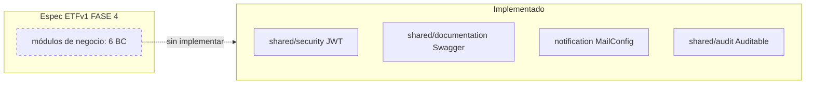

# Architecture — real vs. specified

> Última actualización: 2026-08-24 · Basado en commit `fd8253d`

## Arquitectura especificada (objetivo) — `[DOCUMENTADO]`

**Monolito modular + Hexagonal (Ports & Adapters)**, decisión cerrada en ETFv1 FASE 4 con evaluación de alternativas y descarte explícito de microservicios. Seis bounded contexts como módulos Java (`clientes`, `mensualidades`, `parqueo-transitorio`, `tarifas`, `seguridad`, `reporting`), cada uno con estructura interna `in → application → domain → out`. Comunicación entre módulos por puertos públicos y eventos de dominio in-process. Regla de dependencia: el dominio no importa frameworks ni infraestructura.

Detalle completo: `docs/ETFv1/FASE 4 — ARQUITECTURA.md`.

## Arquitectura real (implementada hoy)

`[CONFIRMADO]` Solo existe la **capa transversal compartida** (`shared/`, `notification/`) más la clase principal; ningún módulo de negocio tiene código:

```
com.example.parking_management
├── ParkingManagementApplication.java   ← entrypoint (@SpringBootApplication, excluye SecurityAutoConfiguration)
├── shared/
│   ├── security/config/SecurityConfig.java      ← filter chain JWT, CORS, BCrypt, stateless
│   ├── security/jwt/JwtAuthenticationFilter.java← filtro OncePerRequestFilter Bearer
│   ├── security/jwt/JwtService.java             ← emisión/validación HS256 (jjwt 0.12.3)
│   ├── documentation/SwaggerOpenApiConfig.java  ← OpenAPI con esquema bearerAuth
│   └── audit/Auditable.java                     ← Mapeable base de auditoría (con bugs, ver KI-05)
├── notification/infrastructure/config/MailConfig.java ← JavaMailSender SMTP Gmail
└── testRest/TestRestLoginAdmin.rest             ← legado (no compila nada, solo texto)
```

No hay controllers, servicios, entidades JPA ni repositorios. La "arquitectura hexagonal" es hoy una convención documentada, no una realidad en el árbol de paquetes de negocio.



## Decisiones estructurales vigentes

| Decisión | Estado | Fuente |
|---|---|---|
| Un contenedor backend + Postgres 16 + stack de monitoreo, Docker Compose | `[CONFIRMADO]` | `docker-compose.yml` |
| Configuración 100% por variables de entorno (sin defaults) | `[CONFIRMADO]` | `backend/src/main/resources/application.properties` |
| REST sobre HTTP/JSON, un controller por módulo bajo `/api/<módulo>` | `[DOCUMENTADO]` (sin controllers aún) | ETFv1 FASE 4 §7 |
| `@Transactional` al borde de application, nunca en dominio | `[DOCUMENTADO]` (sin casos de uso aún) | ETFv1 FASE 4 §5 |
| Migraciones versionadas (Flyway/Liquibase) requeridas | `[DOCUMENTADO]` — **no existe ninguna herramienta de migración en pom.xml** `[CONFIRMADO]` | ETFv1 FASE 4 §5 |

## Referencias

- [modules.md](modules.md) — inventario de módulos/paquetes
- [decisions.md](decisions.md) — ADRs extraídos de ETFv1 y del código
